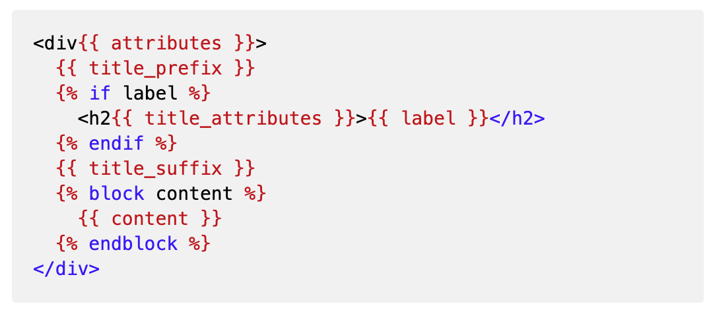

- [Forms, the Form API and AJAX](#forms-the-form-api-and-ajax)
  - [Overview](#overview)
  - [Find a form id in the page source](#find-a-form-id-in-the-page-source)
  - [Set autocomplete to off for user login and password fields](#set-autocomplete-to-off-for-user-login-and-password-fields)
  - [Modify a button on a form with hook_form_alter](#modify-a-button-on-a-form-with-hook_form_alter)
  - [Hide a field with hook_form_alter](#hide-a-field-with-hook_form_alter)
  - [Hide revision info and moderation state](#hide-revision-info-and-moderation-state)
  - [Conditional fields and field states API (#states)](#conditional-fields-and-field-states-api-states)
    - [Conditional fields in new forms](#conditional-fields-in-new-forms)
    - [Conditional fields in existing forms](#conditional-fields-in-existing-forms)
  - [Get the key and value from a select drop-down](#get-the-key-and-value-from-a-select-drop-down)
  - [Field attributes](#field-attributes)
  - [Form Elements](#form-elements)
  - [Add an autocomplete taxonomy form](#add-an-autocomplete-taxonomy-form)
  - [Date validation example](#date-validation-example)
  - [Validating a node add or edit](#validating-a-node-add-or-edit)
  - [Retrieving field values](#retrieving-field-values)
  - [Example form submission with redirect](#example-form-submission-with-redirect)
  - [Provide a block template for a form in a block](#provide-a-block-template-for-a-form-in-a-block)
  - [Add Javascript to a form](#add-javascript-to-a-form)
  - [AJAX Forms](#ajax-forms)
    - [Popup an AJAX modal dialog](#popup-an-ajax-modal-dialog)
    - [AJAX modal dialog with redirect example](#ajax-modal-dialog-with-redirect-example)
      - [Ajax submit](#ajax-submit)
      - [Ajax redirect](#ajax-redirect)
    - [AJAX redirect from a select element (dropdown)](#ajax-redirect-from-a-select-element-dropdown)
    - [Update a value in another field(I am I want) using AJAX](#update-a-value-in-another-fieldi-am-i-want-using-ajax)
    - [I Am I Want revisited](#i-am-i-want-revisited)
      - [Custom responses](#custom-responses)
    - [How do you find all the possible AJAX commands to use with addCommand()?](#how-do-you-find-all-the-possible-ajax-commands-to-use-with-addcommand)
    - [Another AJAX Submit example](#another-ajax-submit-example)
  - [Config Forms](#config-forms)
    - [Generate a config form with drush](#generate-a-config-form-with-drush)
    - [Config forms overview](#config-forms-overview)
  - [Embedding a form:](#embedding-a-form)
  - [Show a form in a block](#show-a-form-in-a-block)
  - [Overview: Implementing forms](#overview-implementing-forms)
    - [Base Classes for forms](#base-classes-for-forms)
    - [Create your class by extending Formbase](#create-your-class-by-extending-formbase)
    - [The main methods](#the-main-methods)
      - [getFormId()](#getformid)
      - [buildForm()](#buildform)
      - [submitForm()](#submitform)
    - [Form validation example #1](#form-validation-example-1)
    - [Form Validation example #2](#form-validation-example-2)


# Forms, the Form API and AJAX

## Overview

Forms can act just like controllers. You can set up a route and call the
form in a very similar fashion. See the example route below:

```yaml
batch_examples.batch:
  path: '/batch-examples/batchform'
  defaults:
    _title: 'Batch'
    _form: 'Drupal\batch_examples\Form\BatchForm'
  requirements:
    _permission: 'access content'
```

## Find a form id in the page source

To find the form_id, edit an article node with the comment form displaying.

Inspect code in chrome

Look for something like this:

```html
<form class="comment-comment-form comment-form" data-drupal-selector="comment-form" action="/comment/reply/node/1/comment" method="post" id="comment-form" accept-charset="UTF-8" data-drupal-form-fields="edit-subject-0-value,edit-comment-body-0-value,edit-comment-body-0-format--2,edit-submit,edit-preview">
```

The formid is `comment_comment_form`. Note *dashes become underscores in
your code*.

Alternatively, you can add a `hook_form_alter` and you can `print_r` or `dsm`
the `$form_id`.  If you prefer, you could also log it to the watchdog log.

```php
function nisto_form_alter(&$form, \Drupal\Core\Form\FormStateInterface $form_state, $form_id){
\Drupal::messenger()->addMessage('Form ID: ' . $form_id);
// Or log it to watchdog log.
\Drupal::logger('nisto_form_alter')->notice('Form ID: ' . $form_id);
```

Notice that a node add form looks like `node_catastrophe_notice_form`
while a node edit form looks more like this: `node_catastrophe_notice_edit_form`


## Set autocomplete to off for user login and password fields

In a .module file use the following code.

```php
/**
 * Implements hook_form_FORM_ID_alter().
 *
 * Turn off autocomplete on login.
 */
function dirt_form_user_login_form_alter(&$form, \Drupal\Core\Form\FormStateInterface $form_state, $form_id) {
  $form['pass']['#attributes']['autocomplete'] = 'off';
  $form['name']['#attributes']['autocomplete'] = 'off';
}
function dirt_form_user_pass_alter(&$form, \Drupal\Core\Form\FormStateInterface $form_state, $form_id) {
  $form['name']['#attributes']['autocomplete'] = 'off';
```


## Modify a button on a form with hook_form_alter

in a `.module` file like web/modules/custom/mymod/mymod.module we can
change the caption on the "save" button to "Comment"

```php
function mymod_form_alter(&$form, \Drupal\Core\Form\FormStateInterface $form_state, $form_id) {
  if ($form_id == 'comment_comment_form') {
    $form['actions']['submit']['#value'] = t('Comment');
  }
}
```

Here is a dropdown form element that I am adding an item to:

```php
$form["topic"]["#options"][992] = "selwyn";
```

And in another `.module` file I nuke the contents of the dropdown topic
and reload it with different content.  These are children of term with tid 2806 sorted by the term name:

```php
function nisto_form_alter(&$form, \Drupal\Core\Form\FormStateInterface $form_state, $form_id){
//  xdebug_break();
  if ($form_id == "views_exposed_form") {
    // Clear the current options.
    $form["topic"]["#options"] = [];

    $tid = 2806;
    $terms = \Drupal::entityTypeManager()->getStorage('taxonomy_term')->loadChildren($tid);
    foreach($terms as $term) {
      $childTerm = $term->get('tid')->value;
      $termName = ucfirst(strtolower($term->get("name")->value));
      $tid = $term->get("tid")->value;
      $form["topic"]["#options"][$tid] = $termName;
    }
    natcasesort($form["topic"]["#options"]);
  }
}
```


## Hide a field with hook_form_alter

In a `.module` file, I used this code to remove access to these fields:

```php
$form['field_highlight_section']['#access'] = 0;
$form['field_accordion_section']['#access'] = 0;
```
This grays out a field:

```php
$form['field_text2']['#disabled'] = true;
```

Here is the whole function where I also check what these is currently in use:

```php
function dan_form_alter(&$form, \Drupal\Core\Form\FormStateInterface $form_state, $form_id) {
  $activeThemeName = \Drupal::service('theme.manager')->getActiveTheme();
  if ($activeThemeName->getName() == 'seven') {
    $form['#attributes']['novalidate'] = 'novalidate';
  }
  if ($form_id == 'views-exposed-form-site-search-page-search') {

    $form['#theme'] = ['header_search_form'];

  }
  // User is editing or adding content of type overview.
  if ($form_id == 'node_overview_edit_form' || $form_id == 'node_overview_form') {
    \Drupal::messenger()->addMessage("blah");
    $form['field_text2']['#disabled'] = true;
    $form['field_highlight_section']['#access'] = 0;
    $form['field_accordion_section']['#access'] = 0;
  }
}
```

## Hide revision info and moderation state

In a `.module` file you can turn off revision information and moderation state like this.

```php
$form['revision_information']['#access'] = FALSE;
$form['moderation_state']['#access'] = FALSE;
```

## Conditional fields and field states API (#states)

Nice article at
<https://mushtaq.ch/blog/11/drupal-8-conditionally-hide-a-form-field>
and <https://www.lullabot.com/articles/form-api-states>

Note. There is a very workable conditional fields module
<https://www.drupal.org/project/conditional_fields> which lets you do
the same sort of thing without any code.

The magic sauce is to use the jQuery selector to identify the field that
will control the states. You can see the left side of the `=>` has the
jQuery code to select a checkbox or radio button.

```php
':input[name="copies_yes_no"]' => ['value' => '0']
```

### Conditional fields in new forms

When creating a new form, you can

1.  Create the field that will control the other field (radio buttons in
    this case)

2.  Create the field that will be hidden (or manipulated in various
    ways)

3.  Create the field with a \[\'#states\'\] index

Here we create the `copies_yes_no` field, then create the
`how_many_oversized field` and then finally the `#states` attribute which
will make the `how_many_oversized` field appear if you click Yes to the
`copies_yes_no` field.

Example form in EstimatorForm.php

```php
$form['nonstandard']['copies_yes_no'] = [
  '#type' => 'radios',
  '#title' => $this->t('Did the requestor ask for copies of nonstandard documents (e.g., oversized paper, DVD, or VHS tape)?'),
  '#default_value' => 0,
  '#options' => array(
    0 => $this
      ->t('Yes'),
    1 => $this
      ->t('No'),
  ),
];

$form['nonstandard']['how_many_oversized'] = [
  '#type' => 'number',
  '#title' => $this->t('Oversized paper copies (e.g., 11 inches by 17 inches, greenbar, bluebar), # of pages'),
  '#min' => 0,
  '#max' => 65535,
  '#size' => 6,
];

$form['nonstandard']['how_many_oversized']['#states'] = [
  // Only show when paper_yes_no is yes.
  'visible' => [
    ':input[name="copies_yes_no"]' => ['value' => '0'],
  ],
];
```
### Conditional fields in existing forms

To customize how fields are handled in an existing form, use
`hook_form_alter` and check to see if you are a node add or edit form for our
type of node. Set the state to visible for `field_cn_original_notice` (so
the user can see it) if the `field_cn_extension` has a value of
checked=TRUE. This has the effect of dynamically displaying the field
once the checkbox for `field_cn_extension` is clicked. The rest of the
function has various other field tweaks

In the org_mods.module

```php
function org_mods_form_alter(array &$form, FormStateInterface $form_state, $form_id) {
  $accountProxy = \Drupal::currentUser();
  $account = $accountProxy->getAccount();
  if (($form_id == 'node_catastrophe_notice_form') || ($form_id == 'node_catastrophe_notice_edit_form')) {

    //Disable field.
    $form['field_cn_end_date']['widget'][0]['value']['#attributes']['disabled'] = 'disabled';
    //Or the simpler.
    $form['field_cn_end_date']['#disabled'] = TRUE;

    if (!$account->hasPermission('administer catastrophe notice')) {
      $form['field_cn_notes']['#access'] = FALSE;
      $form['field_cn_initial_start_date']['#access'] = FALSE;
      $form['field_cn_initial_end_date']['#access'] = FALSE;
      $form['revision_information']['#access'] = FALSE;
      $form['moderation_state']['#access'] = FALSE;
    }

    // Hides Title since it is automatically populated on presave.
    $form['title']['#access'] = FALSE;

    // When the value of field_cn_extension is checked, show this field.
    $form['field_cn_original_notice']['#states'] = [
      'visible' => [
        ':input[name="field_cn_extension[value]"]' => ['checked' => TRUE],
      ],
    ];
  }
}
```


Here is a variant on this theme for making a field visible or required.
In this example, he isn't using the \[value\] as part of the name. When
I tried that above, it didn't seem to work. I guess I didn't have the
correct jquery selector.

```php
$form['field_blah_blah']['#states']= [
  // Only show when scoring_unavailable is not checked.
  'visible' => [
    ':input[name="scoring_unavailable"]' => ['unchecked' => TRUE],
  ],
  'required' => [
    ':input[name="scoring_unavailable"]' => ['unchecked' => TRUE],
  ],
];
```

## Get the key and value from a select drop-down

To get the key and the value that the user sees in the dropdown use the
following. When the dropdown was created, we gave it array of strings so
the key is a zero-based number and the value (`$educationLevel`) is the
string. This shows how to get both.

```php
$key = $form_state->getValue('education_level');
$educationLevel = $form['education_level']['#options'][$key];
```


## Field attributes 

They always begin with `#`. You can find all the possible attributes at [Form Element Reference with examples](https://api.drupal.org/api/drupal/elements/9.4.x)


```php
$form['email'] = [
  '#title' => t('Email Address'),
  '#type' => 'textfield',
  '#size' => 25,
  '#description' => t("We'll send updates to the email address"),
  '#required' => TRUE,
];
$form['submit'] = [
  '#type' => 'submit',
  '#value' => t('RSVP'),
];
$form['nid'] = [
  '#type' => 'hidden',
  '#value' => $nid,
];
```

## Form Elements

[Form Element Reference with examples](https://api.drupal.org/api/drupal/elements/9.4.x)

You can add markup to a form e.g. at web/modules/custom/modal_form_example/src/Form/ExampleForm.php

```php
public function buildForm(array $form, FormStateInterface $form_state, $options = NULL) {

  $form['zzz'] = [
    '#type' => 'markup',
    '#markup' => $this->t('this is a test'),
  ];

  $form['name'] = [
    '#type' => 'textfield',
    '#title' => $this->t('Name'),
    '#size' => 20,
    '#default_value' => 'Joe Blow',
    '#required' => FALSE,
  ];
```

and prefixes and suffices

```php
public function buildForm(array $form, FormStateInterface $form_state, $options = NULL) {

  $form['#prefix'] = '<div id="example_form">';
  $form['#suffix'] = '</div>';
```

Hidden or required via a custom class

```php
  '#maxlength' => 40,
  '#attributes' => [
    'class' => array('hidden'),
  ],
```


Another example:

```php
'first_name' => [
  '#type' => 'textfield',
  '#title' => 'First Name',
  '#default_value' => '',
  '#size' => 25,
  '#maxlength' => 40,
  '#attributes' => [
    'class' => ['required name-on-card'],
  ],
  '#field_prefix' => '<span class="error-msg">*</span>',
```


## Add an autocomplete taxonomy form

This makes a field on your form that automagically starts populating
with terms when you start typing. Here the `$vid` is a vocabulary machine name
like `media_tags`. Not sure what `#tags` does -- It doesn't seem to be
required. Notice vocab id (vid) is a machine name not a number.

```php
$vid1 = 'media_tags';
$form['tags'] = [
  '#type' => 'entity_autocomplete',
  '#title' => $this->t('Tags'),
  '#target_type' => 'taxonomy_term',
  '#selection_settings' => [
    'target_bundles' => [$vid1],  //could be [$vid1, $vid2..].
  ],
//      '#tags' => TRUE,
];
```


## Date validation example

You can also add a custom validation in a .module file. Here we use
setTime()to remove the time part of a datetime so we can make
comparisons of just the date.

From a .module file.

```php
/**
 * Custom form validation for catastrophe notices.
 *
 * Checks if a user enters a date that is more than
 * 2 days earlier than the current date, but only if they didn't
 * check the extension checkbox.
 *
 * @param $form
 * @param \Drupal\Core\Form\FormStateInterface $form_state
 */
function cn_form_validate($form, FormStateInterface $form_state) {
  $extension = $form_state->getValue('field_cn_extension');
  if (is_array($extension)) {
    $extension = $extension['value'];
  }
  $start_date = $form_state->getValue('field_cn_start_date');
  if ($start_date) {
    $start_date = $start_date[0]['value'];
    $start_date->setTime(0, 0, 0);
    $now = new Drupal\Core\Datetime\DrupalDateTime();
    $now->modify("-2 days");
    $now->setTime(0, 0, 0);

    if ($start_date < $now && !$extension) {
      $form_state->setErrorByName('field_cn_start_date', t('The starting date is more than 2 days in the past. Please select a more recent date.'));
    }
  }
}
```


## Validating a node add or edit

In org_mods.module we implement a `hook_form_alter`, and add a validate callback function for anonymous users only.

```php
/**
 * Implements hook_form_alter().
 */
function org_mods_form_alter(array &$form, FormStateInterface $form_state, $form_id) {
  $accountProxy = \Drupal::currentUser();
  $account = $accountProxy->getAccount();

  // Add special validation for anonymous users (node add) only.
  if (($accountProxy->isAnonymous() && ($form_id == 'node_catastrophe_notice_form'))) {
    $form['#validate'][] = 'cn_form_validate';
}
```
And here is the custom validate function which does some fun date arithmetic.

```php
/**
 * Custom form validation for catastrophe notices.
 *
 * Checks if a user enters a date that is more than
 * 2 days earlier than the current date, but only if they didn't
 * check the extension checkbox.
 *
 * @param $form
 * @param \Drupal\Core\Form\FormStateInterface $form_state
 */
function cn_form_validate($form, FormStateInterface $form_state) {
  $extension = $form_state->getValue('field_cn_extension');
  if (is_array($extension)) {
    $extension = $extension['value'];
  }
  $start_date = $form_state->getValue('field_cn_start_date');
  if ($start_date) {
    $start_date = $start_date[0]['value'];
    $start_date->setTime(0, 0, 0);
    $now = new Drupal\Core\Datetime\DrupalDateTime();
    $now->modify("-2 days");
    $now->setTime(0, 0, 0);

    if ($start_date < $now && !$extension) {
      $form_state->setErrorByName('field_cn_start_date', t('The starting date is more than 2 days in the past. Please select a later date'));
    }
  }
}
```


## Retrieving field values

When you go to grab a field value from a form, use getValue(). The values that come back from this are arrays so you have to extract them like this (from org_mods.module)

```php
function cn_form_validate($form, FormStateInterface $form_state) {
  $extension = $form_state->getValue('field_cn_extension');
  if (is_array($extension)) {
    $extension = $extension['value'];
  }
```

Alternatively, you can get all the fields at one time with getValues().
And reference their value like this.

```php
  $values = $form_state->getValues();

  if ($values['op'] == 'Goback') {
    ...
  }
```

If you define the form with fields like `$form[‘header’][‘blah’] = ...` then you can retrieve those with `$form_state->getValue(‘header’,’blah’);`


## Example form submission with redirect

Here is a `submitForm()` function from docroot/modules/custom/websphere_commerce/modules/checkout/src/Form/ReviewForm.php

The call to `$form_state->getValues()` retrieves all the values in the
form. The rest of the logic checks a value and redirects the user to a
specific page.

```php
public function submitForm(array &$form, FormStateInterface $form_state) {
  $values = $form_state->getValues();

  if ($values['op'] == 'Goback') {
    redirectUser('/checkout/' . $values['cart_id'] . '/billing');
  }
```

Here is the source for the redirectUser() call from above.

```php
function redirectUser($path, $route = FALSE) {
  if (!$route) {
    $redirectUrl = Url::fromUserInput($path)->toString();
    $response = new RedirectResponse($redirectUrl);
    $response->send();
  }
  return;
}
```

## Provide a block template for a form in a block

In /modules/custom/dan_pagination/src/Form/VideoPaginationForm.php I
have a form which is displayed in a block. The usual block template file
provided by the theme is `block.html.twig` and looks like this:



Not sure but for some reason github chokes on the twig source for this so I had to use an image.

The template outputs the guts of the block as `{{ block content }}`

For my custom theme called dprime, I added a new template file at
`themes/custom/dprime/templates/block/block--videopaginationblock.html.twig`
and added lots of fun stuff to output the form in bits and pieces.

e.g. like here, to display the previous_clip item from the form's
render array which looks like this:

```php
$form['previous_clip'] = [
  '#type' => 'markup',
  '#markup' => "(Clip $previous_clip_num/$clip_count)",
];
```

I put this in the template:

```twig
<div class="cell medium-6 medium-order-2 text-center">
  {{ content.select }}
</div>

<div class="cell small-6 medium-order-1 medium-3">
  <a href="{{ content.previous_url }}" class="linkPager linkPager--prev">
  <span class="linkPager-icon">
    <span class="icon--arrowLeft" data-grunticon-embed=""></span>
  </span>
    <span class="linkPager-text">
    <span class="linkPager-title">Prev</span>
    {{ content.previous_clip }}
  </span>
  </a>
</div>
```


## Add Javascript to a form

This code is in the [examples](https://www.drupal.org/project/examples)
module in the `DependentDropdown` example where one field depends on the
value from another

From
web/modules/contrib/examples/ajax_example/src/Form/DependentDropdown.php
the form has some Javascript included via a library:

```php
public function buildForm(array $form, FormStateInterface $form_state, $nojs = NULL) {
  // Add our CSS and tiny JS to hide things when they should be hidden.
  $form['#attached']['library'][] = 'ajax_example/ajax_example.library';
```


The `ajax_example.libraries.yml` looks like this:

```yaml
ajax_example.library:
  version: 1.x
  css:
    base:
      css/ajax-example-base.css: {}
  js:
    js/ajax-example.js: {}
```

Notice in the `buildform()` function that the code references the machine
name for the library (not the library's filename which is
`ajax_example.libraries.yml`.)

Here is the JS for completeness:

```JS
(function ($) {

  // Re-enable form elements that are disabled for non-ajax situations.
  Drupal.behaviors.enableFormItemsForAjaxForms = {
    attach: function () {
      // If ajax is enabled, we want to hide items that are marked as hidden in
      // our example.
      if (Drupal.ajax) {
        $('.ajax-example-hide').hide();
      }
    }
  };

})(jQuery);
```


## AJAX Forms

Some really sweet [writeups about AJAX forms](https://www.drupal.org/docs/8/api/javascript-api/ajax-forms)


### Popup an AJAX modal dialog

If you want to have a form pop up a modal dialog or do something via ajax
you have to do some slightly special stuff.

First define what will appear on the dialog

```php
$checkoutLink = '/checkout/' . $get_order_item_id . '/shipping';
$success_modal_popup = [
  '#theme' => 'add_cart_success_modal_popup',
  '#data' => [
    'product_title' => $productDetails->title->value . $popup_title,
    'checkout_link' => $checkoutLink,
    'cart_link' => '/cart',
    'continue_shopping_link' => '<span class="continue-shopping>"Continue Shopping</p>',
      'product_id'=>$product_id,
      'product_price'=>number_format($productDetails_p->price[1]->value, 2),
      'product_category'=>'Singer',
      'product_quantity'=>$product_qty,
  ],
];
$content['#markup'] = render($success_modal_popup);
$content['#attached']['library'][] = 'core/drupal.dialog.ajax';
$content['#attached']['library'][] = 'websphere_commerce_cart/minicart';
```
Then add an ajax command to open the dialog:

```php
$ajax_response->addCommand(
  new OpenModalDialogCommand(t($popup_title), $content, ['width' => '60%', 'dialogClass' => 'product-cart-popup'])
);
return $ajax_response;
```

Don't forget to **return** the `$ajax_response;`


Here is a slightly example displaying a modal dialog:

```php
$addTocartFailed = $websphere_config->get('cart.add_to_cart_failed');
$success_modal_popup = [
  '#theme' => 'add_cart_success_modal_popup',
  '#data' => [
    'addtocart_failed' => $addTocartFailed,
      'product_id'=>$product_id,
      'product_price'=>number_format($productDetails_p->price[1]->value, 2),
      'product_category'=>'Singer',
      'product_quantity'=>$product_qty,
  ],
];
$content['#markup'] = render($success_modal_popup);
$content['#attached']['library'][] = 'core/drupal.dialog.ajax';
$ajax_response->addCommand(
    new OpenModalDialogCommand(t($popup_title), $content, ['width' => '60%', 'dialogClass' => 'product-cart-popup'])
);
return $ajax_response;
```


### AJAX modal dialog with redirect example

From
docroot/modules/custom/websphere_commerce/modules/product/src/Form/AddToCartForm.php

```php

use Drupal\Core\Ajax\RedirectCommand;

class AddToCartForm extends FormBase {
// Create constructor and create functions for dependency injection

public function __construct(PrivateTempStoreFactory $temp_store_factory, SessionManagerInterface $session_manager, AccountInterface $current_user) {
  $this->tempStoreFactory = $temp_store_factory;
  $this->sessionManager = $session_manager;
  $this->currentUser = $current_user;
}

public static function create(ContainerInterface $container) {
  return new static(
      $container->get('user.private_tempstore'), $container->get('session_manager'), $container->get('current_user')
  );
}

// Use buildForm() function to create the elements on the form:
public function buildForm(array $form, FormStateInterface $form_state, $nid = NULL, $productId = NULL) {
```

#### Ajax submit

Submit element is a little special. See all that '#ajax' stuff?

```php
$form['submit'] = array(
  '#type' => 'submit',
  '#attributes' => array('class' => array('mobile-hide')),
  '#id' => 'add_to_cart',
  '#value' => $this->t('Add to cart'),
  '#button_type' => 'primary',
  '#ajax' => array(
    'callback' => '::add_to_cart_submit',
    'event' => 'click',
    'progress' => array(
      'type' => 'throbber',
      'wrapper' => 'editor-settings-wrapper',
    ),
  ),
);
return $form;
```

In this implementation, there is an empty `submitForm()` function. For the
ajax submit callback we use `add_to_cart_submit()`. Note how a `new
AjaxResponse` is created.

```php
public function add_to_cart_submit(array &$form, FormStateInterface $form_state) {
  global $user_status;
  $inputs = $form_state->getUserInput();
  $ajax_response = new AjaxResponse();
  $product_qty = $inputs['product_qty'];
```

Note. This should probably be a static function to avoid this symfony error: 
```
TypeError: Argument 1 passed to Drupal\Core\Routing\RequestContext::fromRequest() must be an instance of Symfony\Component\HttpFoundation\Request, null given
```


#### Ajax redirect

If you want to redirect to the `/cart` url, you must add an AJAX command. See the 
[RedirectCommand in the API Reference](https://api.drupal.org/api/drupal/core%21lib%21Drupal%21Core%21Ajax%21RedirectCommand.php/class/RedirectCommand/9.4.x)

```php
$cartUrl = Url::fromUri('internal:/cart');
$ajax_response->addCommand(
    new RedirectCommand($cartUrl->toString())//Note this is a string!! 
);
return $ajax_response;
```

In a non-ajax form, to redirect to the cart url, we would just use
something like this:

```php
$form_state->setRedirectUrl($cartUrl);
```

### AJAX redirect from a select element (dropdown)

Here I set up a dropdown with the url's and when the user makes a change
in the dropdown, the browser goes to that url. The url's are /node/1
/node/2 etc. For the correct url to be built, we have to prefix
"internal:" to them and that happens in the callback function
`mySelectChange()`.

```php
  /**
   * {@inheritdoc}
   */
  public function buildForm(array $form, FormStateInterface $form_state, $nojs = NULL) {

    // Get the form values and raw input (unvalidated values).
    $values = $form_state->getValues();

    // Define a wrapper id to populate new content into.
    $ajax_wrapper = 'my-ajax-wrapper';

    // Select element.
    $form['my_select'] = [
      '#type' => 'select',
      '#empty_value' => '',
      '#empty_option' => '- Select a value -',
      '#default_value' => (isset($values['my_select']) ? $values['my_select'] : ''),
      '#options' => [
        '/node/1' => 'One',
        '/node/2' => 'Two',
        '/node/3' => 'Three'
      ],
      '#ajax' => [
        'callback' => [$this, 'mySelectChange'],
        'event' => 'change',
        'wrapper' => $ajax_wrapper,
      ],
    ];
    // Build a wrapper for the ajax response.
    $form['my_ajax_container'] = [
      '#type' => 'container',
      '#attributes' => [
        'id' => $ajax_wrapper,
      ]
    ];

    return $form;
  }


  /**
   * The callback function for when the `my_select` element is changed.
   *
   */
  public function mySelectChange(array $form, FormStateInterface $form_state) {

    $values = $form_state->getValues();

    $response = new AjaxResponse();
//    $url = Url::fromUri('internal:/node/2');
    $url = Url::fromUri('internal:' . $values['my_select']);

    $command = new RedirectCommand($url->toString());
    $response->addCommand($command);
    return $response;
  }

  //Don’t forget an empty submitForm().
  public function submitForm(array &$form, FormStateInterface $form_state) {
    // This function left blank intentionally.
  }
```

Invoke the form from the controller with:

return
```php
return \Drupal::formBuilder()->getForm('Drupal\org_opinions\Form\IndividualOpinionForm');
```

The form is at
docroot/modules/custom/org_opinions/src/Form/IndividualOpinionForm.php

And don't forget these:

```php
use Drupal\Core\Form\FormBase;
use Drupal\Core\Form\FormStateInterface;
use Drupal\Core\Link;
use Drupal\Core\Url;
use Drupal\Core\Ajax\AjaxResponse;
use Drupal\Core\Ajax\RedirectCommand;
```

Let's say you have several select elements on the form like `my_select` and `my_select2` like this (Sorry - not too creative, I know.):

```php
$ajax_wrapper = 'my-ajax-wrapper';
// Select.
$form['my_select'] = [
  '#type' => 'select',
  '#empty_value' => '',
  '#empty_option' => '- Select a value -',
  '#default_value' => (isset($values['my_select']) ? $values['my_select'] : ''),
  '#options' => [
    '/node/1' => 'One',
    '/node/2' => 'Two',
    '/node/3' => 'Three'
  ],
  '#ajax' => [
    'callback' => [$this, 'mySelectChange'],
    'event' => 'change',
    'wrapper' => $ajax_wrapper,
  ],
];
  $form['my_select2'] = [
    '#type' => 'select',
    '#empty_value' => '',
    '#empty_option' => '- Select a value -',
    '#default_value' => (isset($values['my_select']) ? $values['my_select'] : ''),
    '#options' => [
      '/node/4' => 'Four',
      '/node/5' => 'Five',
      '/node/6' => 'Six'
    ],
    '#ajax' => [
      'callback' => [$this, 'mySelectChange'],
      'event' => 'change',
      'wrapper' => $ajax_wrapper,
    ],
];
```


Both use the same callback: `mySelectChange`. We can make the callback a
little smarter by figuring out internally which element called it.

```php
  /**
   * Callback function for changes to the `my_select`any select element.
   */
  public function mySelectChange(array $form, FormStateInterface $form_state) {
    $values = $form_state->getValues();


    //$elem stores the element info 
    $elem = $form_state->getTriggeringElement();
    //$value[$elem["#name"]] stores the path like /node/2

    $response = new AjaxResponse();
    // Internal URLS must look like this: 'internal:/node/2'.
//    $url = Url::fromUri('internal:' . $values['my_select']);
    $url = Url::fromUri('internal:' . $values[$elem["#name"]]);

    $command = new RedirectCommand($url->toString());
    $response->addCommand($command);
    return $response;

  }
```


### Update a value in another field(I am I want) using AJAX

This was used for a web page that had 2 dropdown fields.  It showed I am a \_\_\_\_ and I want
\_\_\_\_.

The code makes the assumption that there is only 1 matching `I want` for
each `I am` which is way too limiting but it does illuminate the techniques somewhat. Therefor, if you select an `I am`, you only get 1 choice for an `I
want`.

There is nothing too interesting in the `IamiwantBlock.php` but in the
`iamiwantForm.php` it gets a little more juicy. The form presents two
dropdown fields, `I am` and `I want` and a `go` button. The value in the
`I am` dropdown controls the value in the `I want`.

From: txg/web/modules/custom/iamiwant/src/Form/IamiwantForm.php

The code loads `$nids` from the database, loops thru them, putting them into an
array `$iam` indexed by node id
Then it defines the `$form['iam']` element with all the good `#ajax` stuff including: 

```
1.	The ‘#submit’ callback: ::submitSelectIam
2.	The #executes_submit_callback => TRUE
3.	The ‘callback’ => ‘::ajaxReplaceIwantForm’ specifies what function to call when this field is “submitted”
4.	The ‘wrapper’ => ‘iwant-container’ is the container that will get replaced
5.	The ‘method’ => ‘replace’ which I guess means replace everything in said wrapper.
```
Then it defines the `$form['iwant_container']` and the `$form['iwant_container']['iwant']` element in readiness for the AJAX magic. Lastly it defines the submit `go` button.


```php
public function buildForm(array $form, FormStateInterface $form_state) {
  $nodeStorage = $this->entityTypeManager->getStorage('node');
  // Get i_am_i_want node ids.
  $nids = $nodeStorage->getQuery()
    ->condition('field_iam', NULL, 'IS NOT NULL')
    ->condition('field_iwant', NULL, 'IS NOT NULL')
    ->condition('field_link', NULL, 'IS NOT NULL')
    ->condition('status', NodeInterface::PUBLISHED)
    ->execute();
  $nodes = $nodeStorage->loadMultiple($nids);
  $iam = [];
  foreach ($nodes as $node) {
    /* @var \Drupal\node\NodeInterface $node */
    $iam[$node->id()] = $node->get('field_iam')->getString();
  }
  $form['iam'] = [
    '#type' => 'select',
    '#title' => $this->t('I am'),
    '#options' => $iam,
    '#required' => TRUE,
    '#submit' => ['::submitSelectIam'],
    '#executes_submit_callback' => TRUE,
    '#ajax' => [
      'callback' => '::ajaxReplaceIwantForm',
      'wrapper' => 'iwant-container',
      'method' => 'replace',
    ],
  ];
  $iwant = [];
  // Updates iwant values according to iam.
  if ($node = $form_state->get('node')) {
    $iwant[] = $node->get('field_iwant')->getString();
  }
  $form['iwant_container'] = [
    '#type' => 'container',
    '#prefix' => '<div id="iwant-container">',
    '#suffix' => '</div>',
  ];
  $form['iwant_container']['iwant'] = [
    '#type' => 'select',
    '#title' => $this->t('and I want to'),
    '#options' => $iwant,
  ];
  $form['actions'] = [
    '#type' => 'actions',
  ];
  $form['actions']['submit'] = [
    '#type' => 'submit',
    '#value' => $this->t('Go'),
  ];

  return $form;
}
```


Below is the callback `submitSelectIam` (referenced above) that gets called when the `iamfield` value changes. The code grabs the `iam` value from the form, loads up that node and stores it in the `$form_state` with  `$form_state->set('node', $node);` for use later to decide where to jump to.

In `submitForm()`, it grabs the node, pulls out the URI and does a `setRedirectUrl()` which causes a jump to that URL.

In `submitSelectIam()`, it loads whichever value the user has put in the
iam select. Then he stores that node in the `$form_state`, then calls
`$form_state->setRebuild()`. This is the code that runs each time iam is
chosen.

```php
/**
 * Handles submit call when iam field is selected.
 */
public function submitSelectIam(array $form, FormStateInterface $form_state) {
  $iam = $form_state->getValue('iam');
  $node = $this->entityTypeManager->getStorage('node')->load($iam);
  $form_state->set('node', $node);
  $form_state->setRebuild();
}
```
Then in the callback for the ajax `iam element`. It returns whatever needs
to be replaced in the wrapper container. (from above) It simply returns
the new value for that container (`wrapper`)

```php
    '#ajax' => [
      'callback' => '::ajaxReplaceIwantForm',
      'wrapper' => 'iwant-container',
      'method' => 'replace',
```


```php
/**
 * Handles switching the iam selector.
 */
public function ajaxReplaceIwantForm($form, FormStateInterface $form_state) {
  return $form['iwant_container'];
}
```

And finally, this code does the actual redirecting when the user clicks
go:

```php
public function submitForm(array &$form, FormStateInterface $form_state) {
  /* @var \Drupal\node\NodeInterface $node */
  $node = $form_state->get('node');
  $uri = $node->get('field_link')->getString();
  $url = Url::fromUri($uri);
  $form_state->setRedirectUrl($url);
}
```

This version handles external URL's

```php
public function submitForm(array &$form, FormStateInterface $form_state) {
  /* @var \Drupal\node\NodeInterface $node */
  $node = $form_state->get('node');
  // Get redirect uri from node.
  $fieldLink = $node->get('field_link')->getString();
  $url = Url::fromUri($fieldLink);
  if (UrlHelper::isExternal($fieldLink)) {
    $response = new TrustedRedirectResponse($url->toString());
    $form_state->setResponse($response);
  }
  else {
    $form_state->setRedirectUrl($url);
  }
}
```
When this runs, it has the I am drop down showing '-select-' and the I
want dropdown is empty. The I want dropdown is unresponsive. Hmm.

When I debug, as soon as I change the I am value, `buildForm()` runs,
then `submitSelectIam()`, then `buildForm()` again and then
`ajaxReplaceIwantForm()`. On subsequent runs, it skips the first `buildForm()`
and runs through the sequence of

```
1.	submitSelectIam()
2.	buildForm()
3.	ajaxReplaceIwantForm()
```

In `submitSelectIam()` this code `$form_state->set('node', $node);` stores the node into the form state for later use. You can
`->set()` anything into a form for use later. This means that the
buildForm can pull it back out to figure out the value for the iwant
field, like this (in `buildForm()`). Note. You can do this in a submit
callback but not a callback defined as `'#ajax'`. For some reason,
they are ignored if you do that type.

```php
// Updates iwant values according to iam.
if ($node = $form_state->get('node')) {
  $iwant[] = $node->get('field_iwant')->getString();
}
```
This is the magic bullet as it limits the `$iwant[]` output
to only 1 value and also provides the value needed by the submit (go)
button so it knows where to send the output. Unfortunately this just sets the
`$iwant[]` array to the only one possible `iwant` value. That is not as useful as one would want.

### I Am I Want revisited

Revisiting this code to make it limit the iwant field to only valid
values:

From ddev81/web/modules/custom/iamiwant/src/Form/IamiwantForm.php here
is buildForm() .

```php
public function buildForm(array $form, FormStateInterface $form_state) {
  $nodeStorage = $this->entityTypeManager->getStorage('node');
  // Get i_am_i_want node ids.
  $nids = $nodeStorage->getQuery()
    ->condition('field_iam', NULL, 'IS NOT NULL')
    ->condition('field_iwant', NULL, 'IS NOT NULL')
    ->condition('field_link', NULL, 'IS NOT NULL')
    ->condition('status', NodeInterface::PUBLISHED)
    ->execute();

  // Display the message if nodes don't exist.
  if (empty($nids)) {
    $form['error'] = [
      '#type' => 'item',
      '#markup' => $this->t('No "I am I want" nodes found.'),
    ];
  }

  $nodes = $nodeStorage->loadMultiple($nids);
  $iam = [];
  // Build I am select values.
  foreach ($nodes as $node) {
    $iam[$node->id()] = $node->get('field_iam')->getString();
  }
  $form['iam'] = [
    '#type' => 'select',
    '#title' => $this->t('I am'),
    '#options' => array_unique($iam),
    '#required' => TRUE,
    '#submit' => ['::submitSelectIam'],
    '#executes_submit_callback' => TRUE,
    '#ajax' => [
      'callback' => '::ajaxReplaceIwantForm',
      'wrapper' => 'iwant-container',
      'method' => 'replace',
    ],
  ];
  $iwant = [];
  // Updates iwant values according to iam.
  $node = $form_state->get('node');
  if ($node) {
    $iwant[] = $node->get('field_iwant')->getString();
  }
  $iwantarray = $form_state->get('iwantarray');
  if ($iwantarray) {
    $iwant = [];
    foreach ($iwantarray as $key => $value) {
      $iwant[$key] = $value;
    }
  }
  $form['iwant_container'] = [
    '#type' => 'container',
    '#prefix' => '<div id="iwant-container">',
    '#suffix' => '</div>',
  ];
  $form['iwant_container']['iwant'] = [
    '#type' => 'select',
    '#title' => $this->t('and I want to'),
    '#options' => $iwant,
    '#empty_value' => '',
    '#empty_option' => '- Select -',
    '#prefix' => '<div class="cell imw-want">',
    '#suffix' => '</div>',
    '#submit' => ['::submitSelectIwant'],
    '#executes_submit_callback' => TRUE,
    '#ajax' => [
      'callback' => '::ajaxUpdateActionsForm',
      'wrapper' => 'actions-container',
      'method' => 'replace',
      'progress' => [
        'type' => 'none',
      ],
    ],
  ];

  // Go button.
  $form['actions'] = [
    '#type' => 'actions',
    '#prefix' => '<div class="cell imw-submit" id="actions-container">',
    '#suffix' => '</div>',
  ];
  $form['actions']['submit'] = [
    '#type' => 'submit',
    '#value' => $this->t('Go'),
  ];

  if (!$form_state->get('node')) {
    $form['actions']['submit']['#attributes']['disabled'] = 'disabled';
  }
  return $form;
}
```
Notice that we are checking the `$iwantarray` variable which is set in the
`submitSelectIam()` as shown below. I pull the value from the iam select
dropdown, look up all the possible values for iwant and populate them in
an indexed array. It isndexed by nid which is important later.

```php
/**
 * Handles submit call when iam field is selected.
 */
public function submitSelectIam(array $form, FormStateInterface $form_state) {
  $nodeStorage = $this->entityTypeManager->getStorage('node');
  $iam = $form_state->getValue('iam');
  $node = $nodeStorage->load($iam);
  $iam_text = $node->get('field_iam')->value;
  // Rebuild the iwant values
  // Get i_am_i_want node ids.
  $nids = $nodeStorage->getQuery()
    ->condition('type', 'i_am_i_want')
    ->condition('field_iam', $iam_text)
    ->condition('field_iwant', NULL, 'IS NOT NULL')
    ->condition('field_link', NULL, 'IS NOT NULL')
    ->condition('status', NodeInterface::PUBLISHED)
    ->execute();
  $nodes = $nodeStorage->loadMultiple($nids);
  foreach ($nodes as $node) {
    $iwant[$node->id()] = $node->get('field_iwant')->getString();
  }

  $form_state->set('iwantarray', $iwant);
  $form_state->setRebuild();
}
```


Here is the callback for when the `iwant` is selected. Most importantly,
the line which sets the `$node` into the form_state
(`$formstate->set('node', $node)`) stores the node, so the
submit function can figure out where the go button should take us.

```php
/**
 * Handles submit call when iwant field is selected.
 */
public function submitSelectIwant(array $form, FormStateInterface $form_state) {
  $nodeStorage = $this->entityTypeManager->getStorage('node');
  $iwant = $form_state->getValue('iwant');
  $node = $nodeStorage->load($iwant);
  $form_state->set('node', $node);
  $form_state->setRebuild();
}
```

These two little chaps handle updating the `iwant` container and the go
button (enabling it when there is a valid node set.). These get fired
after the `buildForm()` is run so they can extract meaningful info from
the nice render array that is built and update just the container they
are pointed at. How do I know which container (or wrapper) that is? See
below..

```php
/**
 * Fired from the iam selection to update the iwant select field.
 */
public function ajaxReplaceIwantForm($form, FormStateInterface $form_state) {
  return $form['iwant_container'];
}

/**
 * Fired from the iwant selection to update the go button.
 */
public function ajaxUpdateActionsForm($form, FormStateInterface $form_state) {
  return $form['actions'];
}
```


In the buildForm, we specified `'#ajax'` and identified a callback
function with a wrapper -- this says "replace" the `'iwant-container'`
by calling the `ajaxReplaceIwantForm()` function.

```php
$form['iam'] = [
  '#type' => 'select',
  '#title' => $this->t('I am'),
  '#options' => array_unique($iam),
  '#required' => TRUE,
  '#submit' => ['::submitSelectIam'],
  '#executes_submit_callback' => TRUE,
  '#ajax' => [
    'callback' => '::ajaxReplaceIwantForm',
    'wrapper' => 'iwant-container',
    'method' => 'replace',
  ],
];
```
And if you look at the definition of the form in buildForm, you'll see
that the `$form['iwant_container']` is clearly defined like this:

```php
$form['iwant_container'] = [
  '#type' => 'container',
  '#prefix' => '<div id="iwant-container">',
  '#suffix' => '</div>',
];
```
With a form element in it

```php
$form['iwant_container']['iwant'] = [
  '#type' => 'select',
  '#title' => $this->t('and I want to'),
  '#options' => $iwant,
  '#empty_value' => '',
  '#empty_option' => '- Select -',
  '#prefix' => '<div class="cell imw-want">',
  '#suffix' => '</div>',
  '#submit' => ['::submitSelectIwant'],
  '#executes_submit_callback' => TRUE,
  '#ajax' => [
    'callback' => '::ajaxUpdateActionsForm',
    'wrapper' => 'actions-container',
    'method' => 'replace',
    'progress' => [
      'type' => 'none',
    ],
  ],
];
```
So the code that "replaces" the `iwant_container` simply does a

```php
      return $form['iwant_container'];
```
after buildform has run and filled in the `$form['iwant_container']`

Magic!

`ajaxUpdateActionsForm()` cleverly enables the Go button when there is a
node stored in the form, otherwise it is disabled (from buildForm()). It
actually just replaces the whole element with an enabled version:

```php
/**
 * Fired from the iwant selection to update the go button.
 */
public function ajaxUpdateActionsForm($form, FormStateInterface $form_state) {
  return $form['actions'];
}
```
This only runs if there is a node, otherwise the Go button is enabled.
It seems a little counterintuitive to leave it enabled and only disable if
there isn't a node but it would probably work fine the other way around

```php
if (!$form_state->get('node')) {
  $form['actions']['submit']['#attributes']['disabled'] = 'disabled';
}
```
Phew! The explanation is much longer than the actual code.  Hopefully it is helpful in explaining the intricasies of AJAX Drupal magic.


#### Custom responses

Here rather than just returning the part of the form we want to update,
we can add a response followed by some JavaScript that should do
something. While it seems this should work, sadly it doesn't unless I wrap the function in `(function($){})(jQuery);`. More below.

```php
use Drupal\Core\Ajax\AjaxResponse;
use Drupal\Core\Ajax\InvokeCommand;
use Drupal\Core\Ajax\ReplaceCommand;


  /**
   * Fired from the iam selection to update the iwant select field.
   */
  public function ajaxReplaceIwantForm($form, FormStateInterface $form_state) {
//    return $form['iwant_container'];
    $response = new AjaxResponse();
    $response->addCommand(new ReplaceCommand('#iwant-container', $form['iwant_container']));
    $response->addCommand(new InvokeCommand(NULL, 'initCustomForms'));
    return $response;


  }
```
I made a new function called myinitCustomForms in app.js
(/Users/selwyn/Sites/txg/web/themes/custom/txg/foundation/src/assets/js/app.js
)

```php
    $response->addCommand(new InvokeCommand(NULL, 'myinitCustomForms'));
    return $response;
```
And it works a treat!!

From <https://www.drupal.org/docs/8/api/javascript-api/ajax-forms>

They suggest an example (which I tried in txg/web/themes/custom/txg/foundation/src/assets/js/app.js
)

```JS
(function($) {
  // Argument passed from InvokeCommand.
  $.fn.myAjaxCallback = function(argument) {
    console.log('myAjaxCallback is called.');
    // Set textfield's value to the passed arguments.
    $('input#edit-output').attr('value', argument);
  };
})(jQuery);
```
This works fine when called with:

```php
$response->addCommand(new InvokeCommand(NULL, 'myAjaxCallback', ['This is the new text!']));
```
So my old js function:

```JS
// initialize custom form elements
function initCustomForms() {
    jcf.setOptions('Select', {
        maxVisibleItems: 6,
        wrapNative: false,
        wrapNativeOnMobile: false

    });
    jcf.replaceAll();
}
```
Should be  wrapped in `(function($){}`

```JS
(function($) {
  // Argument passed from InvokeCommand.
  $.fn.myinitCustomForms = function(argument) {
    console.log('myinitCustomForms is called.');
    jcf.setOptions('Select', {
      maxVisibleItems: 6,
      wrapNative: false,
      wrapNativeOnMobile: false

    });
    jcf.replaceAll();
  };
})(jQuery);
```


### How do you find all the possible AJAX commands to use with addCommand()? 

Just look in docroot/core/lib/Drupal/Core/Ajax

You will see a bunch of different classes - All the Commands you want to
use with `addCommand()` for AJAX response e.g. `RedirectCommand` or
`OpenModalDialogCommand`.

### Another AJAX Submit example

There is another example of a form with an AJAX submit in
docroot/modules/custom/quick_pivot/src/Form/QuickPivotSubscribeForm.php

Note how the callback is explicitly spelled out as:

```php
'callback' => 'Drupal\quick_pivot\Form\QuickPivotSubscribeForm::quickPivotAjaxSubmit',
```

Build the form:


```php
public function buildForm(array $form, FormStateInterface $form_state) {
  $form['#id'] = 'quick-pivot-subscribe-form';
  $form['#cache'] = ['max-age' => 0];
  $form['#attributes'] = ['autocomplete' => 'off'];

  $form['email'] = [
    '#type' => 'textfield',
    '#id' => 'quick-pivot-email',
    '#placeholder' => $this->t('Email address'),
    '#attributes' => ['class' => ['edit-quick-pivot-email']],
    '#prefix' => '<div class="subscriber-email-msg">',
    '#suffix' => '</div>',
  ];
  $form['actions']['subscribe_submit'] = [
    '#type' => 'submit',
    '#value' => $this->t('Sign Up'),
    '#name' => 'quick_pivot_subscribe_form_submit_button',
    '#ajax' => [
      'callback' => 'Drupal\quick_pivot\Form\QuickPivotSubscribeForm::quickPivotAjaxSubmit',
      'wrapper' => 'quick-pivot-subscribe-form',
      'progress' => ['type' => 'throbber', 'message' => NULL],
    ],
  ];
  $form['message'] = [
    '#type' => 'markup',
    '#markup' => '<div id="quick-pivot-message-area"></div>',
  ];

  return $form;
}
```

Leave the `validateForm()` and `submitForm()` functions empty.

Here is the ajax callback. Note the function has to be static to avoid
the possible error: 

```
TypeError: Argument 1 passed to Drupal\Core\Routing\RequestContext::fromRequest() must be an instance of Symfony\Component\HttpFoundation\Request, null given 
```
This error seems to have something to do with memcache and anonymous users.

```php
public static function quickPivotAjaxSubmit(array &$form, FormStateInterface $form_state) {
  $validate = TRUE;
  $email = trim($form_state->getValue('email'));
  if (!filter_var($email, FILTER_VALIDATE_EMAIL)) {
    $message = t('Please enter a valid email address.');
    $validate = FALSE;
    $css_border = ['border' => '1px solid red'];
    $css_color = ['color' => 'red'];
  }
  if ($validate) {
    $css_border = ['border' => '1px solid green'];
    $css_color = ['color' => 'green'];
    $response = \Drupal::service('quick_pivot.api')->subscribeEmail($email);
    if (strpos(reset($response), 'Success') !== FALSE) {
      $message = t('Thank you for signing up. Your subscription has been activated.');
    }
    else {
      $message = t('Your subscription could not be processed.');
    }
  }

  $response = new AjaxResponse();

  $quick_pivot_form = \Drupal::formBuilder()->rebuildForm('quick_pivot_subscribe_form', $form_state);
  if ($validate) {
    $quick_pivot_form['email']['#value'] = '';
    $quick_pivot_form['email']['#placeholder'] = t('Email address');
  }
  $response->addCommand(new ReplaceCommand('#quick-pivot-subscribe-form', $quick_pivot_form));
  $response->addCommand(new CssCommand('#edit-quick-pivot-email', $css_border));
  $response->addCommand(new HtmlCommand('#quick-pivot-message-area', $message));
  $response->addCommand(new CssCommand('#quick-pivot-message-area', $css_color));
  return $response;
}
```


## Config Forms


### Generate a config form with drush

Use the [drush command](https://www.drush.org/latest/generators/form_config/)
`drush generate form:config` for a quick boilerplate version.

### Config forms overview

Configuration forms extend ConfigFormBase so be sure to 
```php
use Drupal\Core\Form\ConfigFormBase;
```

The `$config` object has `get()`, `set()` and `save()` methods to access config information.

Create a `module.settings.yml` file in config/install directory for config objects that the module needs.

Also create a `module.schema.yml` file in config/schema for schema info i.e.  definitions and mappings for config objects

Implement the following methods: `buildForm()`, `getEditableConfigNames()`, `getFormId()`, `submitForm()`, `validateForm()`.

from dev1/web/modules/custom/rsvp/src/Form/RSVPConfigurationForm.php
here is the `buildForm()` function.

```php
  /**
   * @inheritDoc
   */
  public function buildForm(array $form, FormStateInterface $form_state) {
//    $types = node_types_get_names();

    $config = $this->config('rsvp.settings');
    $node_types = \Drupal\node\Entity\NodeType::loadMultiple();
    // If you need to display them in a drop down:
    $options = [];
    foreach ($node_types as $node_type) {
      $options[$node_type->id()] = $node_type->label();
    }

    $form['rsvp_node_types'] = array(
      '#type' => 'checkboxes',
      '#title' => $this->t('The content types top enable rSVP collection for'),
      '#default_value' => $config->get('allowed_types'),
      '#options' => $options,
      '#description' => $this->t('On the specified node types, an RSVP option will be available and can be enabled while that node is being edited.'),
    );
    $form['array_filter'] = array('#type' => 'value', '#value' => TRUE);
    return parent::buildForm($form, $form_state);
  }
```

And the `submitForm()`


```php
/**
 * @inheritDoc
 */
public function submitForm(array &$form, FormStateInterface $form_state) {
  $allowed_types = array_filter($form_state->getValue('rsvp_node_types'));
  sort($allowed_types);
  $this->config('rsvp.settings')
    ->set('allowed_types', $allowed_types)
    ->save();

  parent::submitForm($form, $form_state);
}
```

To set a default value for when the module is first installed, create
web/modules/custom/rsvp/config/install/rsvp.settings.yml

```yaml
allowed_types:
  - article
```
and to specify more details of what the config stores, create the
/Users/selwyn/Sites/dev1/web/modules/custom/rsvp/config/schema/rsvp.schema.yml

```yaml
#Schema for config file of rsvp module
rsvp.admin_settings:
  type: config_object
  label: 'RSVP Content Type Settings'
  mapping:
    allowed_types:
      type: sequence
      label: 'Content types RSVP form can display on'
      sequence:
        type: string
        label: 'Content type'
```


## Embedding a form:

In this example, there is a form called `ExampleForm` at
web/modules/custom/test/src/Form/ExampleForm.php

To render a form programmatically, either inside a Controller or a
block, use the `FormBuilder` service. The form builder can be injected
using the form_builder service key or used statically to then build the
form (which returns a render array)

```php
$form = \Drupal::formBuilder()->getForm('Drupal\test\Form\ExampleForm');
$build['egform'] = $form;
return $build;
```

## Show a form in a block

In dev1/web/modules/custom/rsvp/src/Plugin/Block/RSVPBlock.php you can
see in the build() method, we invoke a form like this:

```php
class RSVPBlock extends BlockBase {

  /**
   * @inheritDoc
   */
  public function build() {
    return \Drupal::formBuilder()->getForm('Drupal\rsvp\Form\RSVPForm');
  }
```

In
docroot/modules/custom/quick_pivot/src/Plugin/Block/QuickPivotSubscribeBlock.php
we use dependency injection to pass in the `FormBuilderInterface` and then get the form in a very similar way.

The constructor grabbed the formbuilder like this:

```php
public function __construct(array $configuration, $plugin_id, $plugin_definition, ConfigFactoryInterface $config_factory, FormBuilderInterface $form_builder) {
  parent::__construct($configuration, $plugin_id, $plugin_definition);

  $this->configFactory = $config_factory;
  $this->formBuilder = $form_builder;
}

public function build() {
  return $this->formBuilder->getForm('Drupal\quick_pivot\Form\QuickPivotSubscribeForm');
}
```

## Overview: Implementing forms

Forms live in module/src/Form/MyClassForm.php e.g.
/modules/custom/dmod/src/Form/HeaderFooterForm.php

### Base Classes for forms

-   FormBase -- for any old form

-   ConfirmFormBase -- for generic confirmation form

-   ConfigFormBase -- for config forms

### Create your class by extending Formbase

```php
class HeaderFooterForm extends FormBase {
```


### The main methods

Forms typically need a `buildForm()`, `submitForm()` and `getFormId()` member.
Validation is handled with a `validateForm()` member.


#### getFormId()

It only returns a simple string identifying the form, e.g.

```php
public function getFormId() {
  return 'dan_header_footer_form';
}
```

#### buildForm()

Create the render array representing the form elements. Here I am using a fieldset to group fields. Also the `'#default_value'` provides a default value that users can edit.

```php
$form['instructions'] = [
  '#type' => 'markup',
  '#markup' => $this->t('After clicking submit, test changes on the header and footer of the home page.<br/><br/>')
];
$form['header'] = [
  '#type' => 'fieldset',
  '#title' => $this->t('Header'),
  '#collapsible' => TRUE,
  '#open' => TRUE,
];
$form['header']['logo_url'] = [
  '#type' => 'url',
  '#title' => $this->t('Logo URL'),
  '#size' => 64,
  '#default_value' => $logo_url,
];
$form['footer'] = [
  '#type' => 'fieldset',
  '#title' => $this->t('Footer'),
  '#collapsible' => TRUE,
  '#open' => TRUE,
];
$form['footer']['footer_address1'] = [
  '#type' => 'textfield',
  '#title' => $this->t('Address line 1'),
  '#default_value' => $address1,
];


// You need a submit button so users can click on something.
$form['submit'] = [
  '#type' => 'submit',
  '#value' => $this->t('Save'),
];
```

And don't **EVER** forget to return the \$form render array you just
created (otherwise you get an empty form)

```php
return $form;
```

#### submitForm()

When a user clicks on the submit button, this function is called.
You can extract the entries from the `$form_state` and decide what to do
with them. In this example we write them into the database using the
`State API`.  State API values are stored in the `key_value` table.

```php
$values = $form_state->getValues();

$address1 = $values['footer_address1'];
$address2 = $values['footer_address2'];
$address3 = $values['footer_address3'];
$email = $values['email'];
$logo_url = $values['logo_url'];
$facebook = $values['facebook'];
$linkedin = $values['linkedin'];
$instagram = $values['instagram'];
$twitter = $values['twitter'];
$youtube = $values['youtube'];
```
Writing:

```php
\Drupal::state()->set('logo_url', $logo_url);
\Drupal::state()->set('footer_address1', $address1);
\Drupal::state()->set('footer_address2', $address2);
\Drupal::state()->set('footer_address3', $address3);
\Drupal::state()->set('footer_email', $email);
\Drupal::state()->set('footer_facebook', $facebook);
\Drupal::state()->set('footer_instagram', $instagram);
\Drupal::state()->set('footer_linkedin', $linkedin);
\Drupal::state()->set('footer_twitter', $twitter);
\Drupal::state()->set('footer_youtube', $youtube);

\Drupal::messenger()->addMessage('Values updated');
```

To display the results of the form entry you can put this in
`submitForm()`.

```php
// Display result.
foreach ($form_state->getValues() as $key => $value) {
  \Drupal::messenger()
    ->addMessage($key . ': ' . ($key === 'text_format' ? $value['value'] : $value));
}
```

### Form validation example #1

Check a string length for the `company_name` field.

```php
public function validateForm(array &$form, FormStateInterface $formState) {
  if (!$formState->isValueEmpty('company_name')) {
    if (strlen($formState->getValue('company_name')) <= 5) {
      //Set validation error.
      $formState->setErrorByName('company_name', t('Company name is less than 5 characters'));
    }
  }
}
```

### Form Validation example #2

From web/modules/custom/rsvp/src/Form/RSVPForm.php we call Drupal's `email.validator` service and if it fails, setErrorByName()

```php
public function validateForm(array &$form, FormStateInterface $form_state) {
  $value = $form_state->getValue('email');
  if ($value == !\Drupal::service('email.validator')->isValid($value)) {
    $form_state->setErrorByName('email', t('The email %mail is not valid.', ['%mail'=> $value]));
  }

  parent::validateForm($form, $form_state);
}
```


[home](../index.html)

