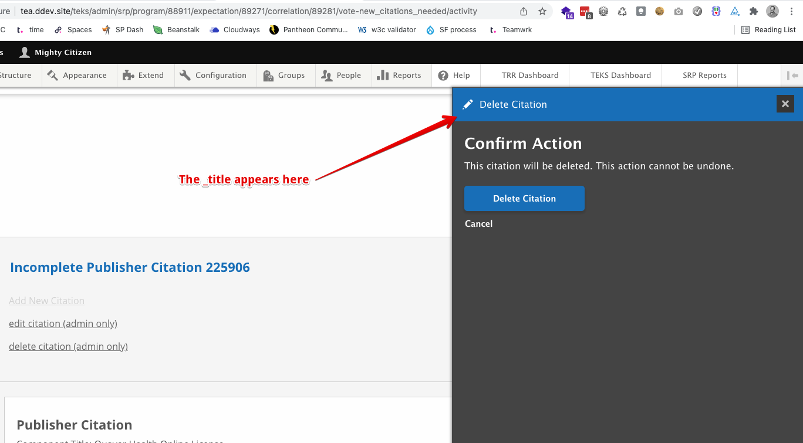
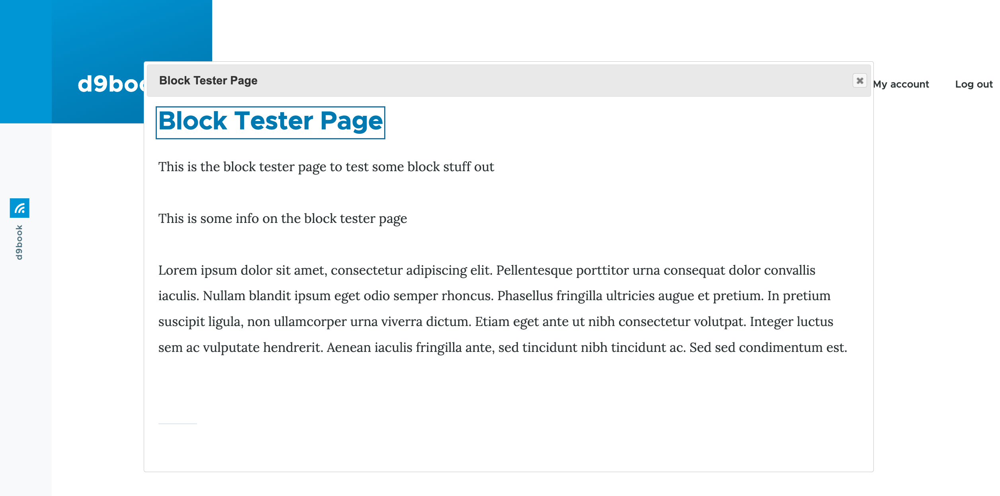
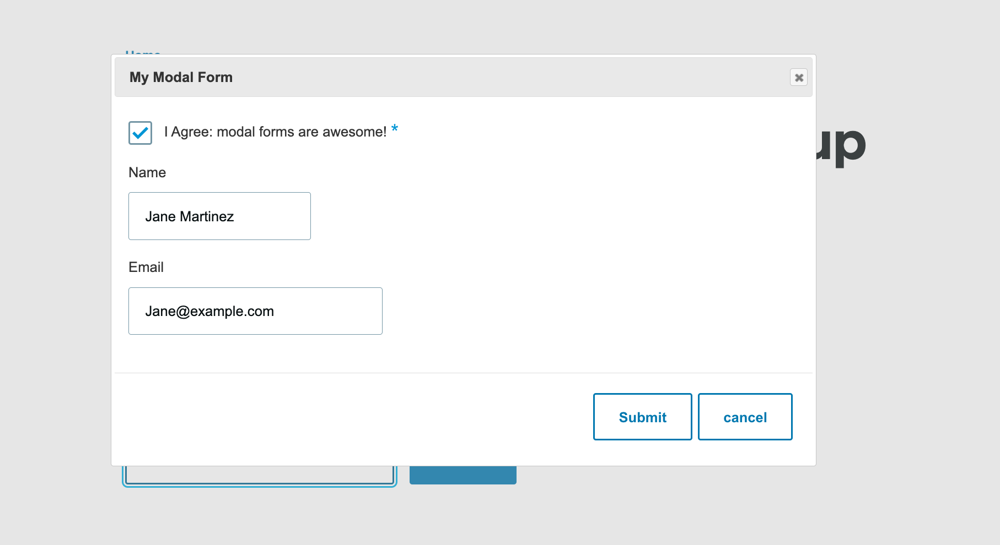
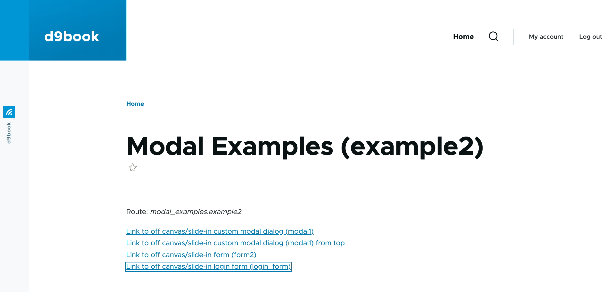
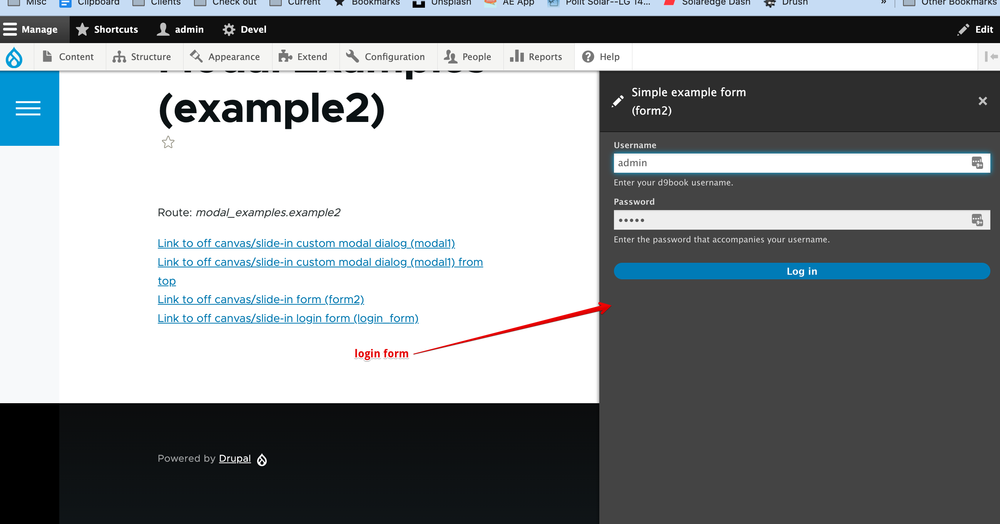

# Modal Dialogs

<h3 style="text-align: center;">
<a href="/d9book">home</a>
</h3>


- [Modal Dialogs](#modal-dialogs)
  - [Overview](#overview)
  - [Dialog title](#dialog-title)
  - [Links to slide-in dialogs](#links-to-slide-in-dialogs)
  - [Modal dialog example](#modal-dialog-example)
    - [Passing entities as parameters](#passing-entities-as-parameters)
  - [Modal form example](#modal-form-example)
  - [Slide-in dialog/Off-canvas dialog](#slide-in-dialogoff-canvas-dialog)
  - [Slide-in Dialog Example](#slide-in-dialog-example)
  - [Block with a link to popup a custom modal dialog](#block-with-a-link-to-popup-a-custom-modal-dialog)
  - [No-code modal dialogs](#no-code-modal-dialogs)
  - [Resources](#resources)


<h3 style="text-align: center;">
<a href="/d9book">home</a>
</h3>


## Overview

There are several ways to create modal dialogs in Drupal. Modal dialogs
provide a way to display additional information without having to reload
the entire page. These dialogs can display anything you can imagine
including static text, an image, a node, a form, a view or any custom
markup.

## Dialog title

You define the title for the dialog by specifying it in the
\*.routing.yml file. In the file below the title is in the \_title key:

```yaml
taa.srp_delete_citation:
  path: '/taa/admin /citation/delete/citation/{citation}'
  defaults:
    _title: 'Delete Citation'
    _form: 'Drupal\taa\Form\DeleteCitationForm'
```



## Links to slide-in dialogs

In your controller (or in a form) you can define links in your render array which can fire off the slide-in dialogs. E.g.

```php
use Drupal\Component\Serialization\Json;

$submit_for_review_link = [
  '#type' => 'link',
  '#title' => t('Submit for Review'),
  '#url' => Url::fromRoute('taa_teks_publisher.submit_for_review', ['node' => $node->id(), 'return_type' => 'program']),
  '#attributes' => [
    'class' => ['use-ajax', 'button'],
    'id' => 'edit-program-' . $node->id(),
    'data-dialog-renderer' => 'off_canvas',
    'data-dialog-type' => 'dialog',
    'data-dialog-options' => Json::encode(
      [
        'width' => '600',
      ]
    ),
  ],
];
```


Notice the data-dialog- options. 'off_canvas' is the magic sauce. Also
note that the parameters that are passed to the form are 'node' and
'return_type' which are specified in the route below also.

Note the class 'button' will make this link show up as a button. If you
remove it, this will instead just be a link.

You could easily make this a modal dialog by specifying:

```php
'data-dialog-type' => 'modal',
'data-dialog-options' => Json::encode([ 'width' => 'auto',]),
```


## Modal dialog example

This example displays a page with links to pop up two different modal
dialogs. Clicking on either of the links will display a slightly
different modal dialogs. The page looks like this:


Here is the routing file at
web/modules/custom/modal_examples/modal_examples.routing.yml.

The first route (modal_examples.example1) displays the links. The second
route (modal_examples.modal1) allows the modal be displayed on a page on
its own. This route also has parameters which can be useful when you
want to display some relevant variable information in the dialog.


```yaml
# Controller with buttons to open modals
modal_examples.example1:
  path: '/modal-examples/example1'
  defaults:
    _title: 'Modal Examples (example1)'
    _controller: '\Drupal\modal_examples\Controller\ModalExamplesController::buildExample1'
  requirements:
    _permission: 'access content'
# first modal
modal_examples.modal1:
  path: '/modal-examples/modal1/{program_id}/{type}'
  defaults:
    _title: 'Modal 1 with parameters'
    _controller: '\Drupal\modal_examples\Controller\ModalExamplesController::buildModal1'
  requirements:
    _permission: 'access content'
  options:
    parameters:
      program_id:
      type:
    no_cache: 'TRUE'


# Second modal 
# You can't use this route directly
# route for modal to display a teaser of a node in a dialog
modal_examples.modal2:
  path: '/modal-examples/create-my-dialog'
  defaults:
    _controller: '\Drupal\modal_examples\Controller\ModalExamplesController2::createDialogFromNode'
  requirements:
    _access: 'TRUE'
```

In
web/modules/custom/modal_examples/src/Controller/ModalExamplesController.php
are the functions for both the page (which displays the link) and first
modal.

Add the parameters to the end of the `Url::fromRoute()` call to pass them to the modal. You will probably do this a lot.

```php
'#url' => Url::fromRoute('modal_examples.modal1', [
  'program_id'     => 123,
  'type' => 'all',
 ]),
```


```php
<?php

namespace Drupal\modal_examples\Controller;

use Drupal\Component\Serialization\Json;
use Drupal\Core\Controller\ControllerBase;
use Drupal\Core\Url;

/**
 * Returns responses for Modal Examples routes.
 */
class ModalExamplesController extends ControllerBase {

  public function buildExample1() {

    $route_name = \Drupal::routeMatch()->getRouteName();
    $build['content'] = [
      '#type' => 'item',
      '#markup' => $this->t('Route: %route', ['%route' => $route_name]),
    ];

    $build['link-to-modal1'] = [
      '#type'       => 'link',
      '#title'      => t('Link to a custom modal (modal1)'),
      '#url'        => Url::fromRoute('modal_examples.modal1', [
        'program_id'     => 123,
        'type' => 'all',
      ]),
      '#attributes' => [
        'id' => 'view-correlation-' . 12345,
        'class' => ['use-ajax'],
        'aria-label' => 'View useful information pertaining to item ' . '12345',
        '#prefix' => '<div class="abcdef">',
        '#suffix' => '</div>',
        'data-dialog-type' => 'modal',
        'data-dialog-options' => Json::encode(
          [
            'width' => 'auto',
          ]
        ),
      ],
    ];

    $build['link-to-modal2'] = [
      '#type' => 'link',
      '#url' => new Url('modal_examples.modal2'),
      '#title' => 'Link to a node in a dialog (modal2)',
      '#prefix' => '<div class="pqrst">',
      '#suffix' => '</div>',
      '#attributes' => [
        'class' => ['use-ajax'],
      ],
    ];

    $build['#attached']['library'][] = 'core/drupal.dialog.ajax';

    return $build;
  }

  public function buildModal1(int $program_id, string $type) {

    $build['content'] = [
      '#type' => 'item',
      '#markup' => $this->t('Some useful information!'),
    ];
    $build['other_content'] = [
      '#type' => 'item',
      '#markup' => $this->t('Program id: @program_id. Type: @type', [
        '@program_id' => $program_id,
        '@type' => $type,
      ]),
    ];

    return $build;
  }

}
```

The second modal is in ModalExamplesController2.php. This dialog uses
the example from an example at
<https://www.hashbangcode.com/article/drupal-9-creating-ajax-dialogs>
which displays a teaser view of a node:


```php
<?php

/**
 * @file
 *
 * Contains \Drupal\modal_examples\Controller\ModalExamplesController2.
 */
namespace Drupal\modal_examples\Controller;

use Drupal\Core\Ajax\OpenDialogCommand;
use Drupal\Core\Entity\EntityTypeManagerInterface;
use Symfony\Component\DependencyInjection\ContainerInterface;
use Drupal\Core\Ajax\AjaxResponse;
use Drupal\Core\Ajax\OpenModalDialogCommand;
use Drupal\Core\Controller\ControllerBase;
use Drupal\Core\Form\FormBuilder;


/**
 * ModalExamplesController2 class.
 */
class ModalExamplesController2 extends ControllerBase {

  /**
   * The form builder.
   *
   * @var \Drupal\Core\Form\FormBuilder
   */
  protected $formBuilder;

  /**
   * The entity type manager.
   *
   * @var \Drupal\Core\Entity\EntityTypeManagerInterface
   */
  protected $entityTypeManager;

  /**
   * The ModalFormExampleController constructor.
   *
   * @param \Drupal\Core\Form\FormBuilder $formBuilder
   *   The form builder.
   * @param \Drupal\Core\Entity\EntityTypeManagerInterface $entity_type_manager
   *   The entity type manager.
   */
  public function __construct(FormBuilder $formBuilder, EntityTypeManagerInterface $entity_type_manager) {
    $this->formBuilder = $formBuilder;
    $this->entityTypeManager = $entity_type_manager;
  }

  /**
   * {@inheritdoc}
   *
   * @param \Symfony\Component\DependencyInjection\ContainerInterface $container
   *   The Drupal service container.
   *
   * @return static
   */
  public static function create(ContainerInterface $container) {
    return new static(
      $container->get('form_builder'),
      $container->get('entity_type.manager'),
    );
  }


  /*
   * Phil's open a dialog to display a node teaser.
   */
  public function createDialogFromNode() {
    // Load a specific node.
    $node = $this->entityTypeManager->getStorage('node')->load(34);

    // Convert node into a render array.
    $viewBuilder = $this->entityTypeManager->getViewBuilder('node');
    $content = $viewBuilder->view($node, 'teaser');

    // Get the title of the node.
    $title = $node->getTitle();

    // Create the AjaxResponse object.
    $response = new AjaxResponse();

    // Attach the library needed to use the OpenDialogCommand response.
    $attachments['library'][] = 'core/drupal.dialog.ajax';
    $response->setAttachments($attachments);

    // Add the open dialog command to the ajax response.
    $response->addCommand(new OpenDialogCommand('#my-dialog-selector', $title, $content, ['width' => '70%']));
    return $response;
  }

}
```

Here is the first modal dialog as it appears on the site when the modal1
link is clicked:


And the second




### Passing entities as parameters

Sometimes it is useful to pass a node as a parameter so you can quickly
grab fields from it. To do this, specify type: entity: node (or other
type of entity) in the \*.routing.yml file. See the example below where
parameters: program and correlation are identified as nodes. In your
code, you pass the node id (not the entire node) and Drupal will
automatically load the node for you and pass it to the controller:

```yaml
taa.view_votes:
  path: '/srp/program/{program}/vote-view/correlation/{correlation}/{type}'
  defaults:
    _controller: '\Drupal\taa\Controller\ViewVotesController::content'
    _title: 'Votes for Citation'
  requirements:
    _permission: 'view any saa item+view own saa item'
  options:
    parameters:
      program:
        type: entity:node
      correlation:
        type: entity:node
    no_cache: 'TRUE'
```

The controller will look like this. Notice how we can call entity functions on the \$program and \$correlation entities.

```php
public function content(EntityInterface $program, EntityInterface $correlation, string $type = 'all'): array {
  $program_nid = $program->id();
  $correlation_nid = $correlation->id();
  $vote_number = $program->get('field_srp_vote_number')->value;
```

## Modal form example

This example displays a form with a button. When a user presses the
button, a dialog containing another form appears.

This code is a little convoluted as the link you click to open the modal
form calls a controller function, 
`ModalExamplesController2::openModalForm()`, which loads the form and opens it with an ajax command, `OpenModalDialogCommand`. You can directly point a link to a form route (as you can find in other examples below.)

Also notice that controller uses dependency injection to load the form
builder (which *is* the recommended way to do things.).

In web/modules/custom/modal_examples/modal_examples.routing.yml we first
set up a route for the form which will be initially displayed. This is identified as `modal_examples.form1.`

Secondly, we set up a route for the popup form, `modal_examples.modal_form.`

```yaml
modal_examples.form1:
  path: '/modal-examples/form1'
  defaults:
    _form: 'Drupal\modal_examples\Form\ExampleForm'
    _title: 'Form with a button to popup a modal form'
  requirements:
    _permission: 'administer site configuration'

modal_examples.modal_form:
  path: '/modal-examples/modal_form'
  defaults:
    _title: 'The Modal Form'
    _controller: '\Drupal\modal_examples\Controller\ModalExamplesController2::openModalForm'
  requirements:
    _permission: 'administer site configuration'
  options:
    _admin_route: TRUE
```


When we navigate to `/modal-example/form`, we see the following form. If
we click the button labelled, \"Click to see the Modal Form\", a modal dialog will appear with a form in it.

 Here is the initial form:


And here is the modal popped up over it:



Here is the code for the first form in 
`web/modules/custom/modal_examples/src/Form/ExampleForm.php`. Notice the
link at `$form['actions']['open_modal']` which is used to invoke
the modal form. Note. It is essential that you specify the use-ajax class for
this link.

```php
<?php

namespace Drupal\modal_examples\Form;

use Drupal\Core\Form\FormBase;
use Drupal\Core\Form\FormStateInterface;
use Drupal\Core\Url;

/**
 * ExampleForm class.
 */
class ExampleForm extends FormBase {

  /**
   * {@inheritdoc}
   */
  public function buildForm(array $form, FormStateInterface $form_state, $options = NULL) {

    $form['#prefix'] = '<div id="example_form">';
    $form['#suffix'] = '</div>';

    $form['info']['instructions'] = [
      '#type' => 'markup',
      '#markup' => $this->t('Please fill out the form below and click the button for more info.'),
    ];

    $form['info']['name'] = [
      '#type' => 'textfield',
      '#title' => $this->t('Name'),
      '#size' => 20,
      '#default_value' => 'Mary Vasquez',
      '#required' => FALSE,
    ];

    $form['actions']['open_modal'] = [
      '#type' => 'link',
      '#title' => $this->t('Click to see the Modal Form'),
      '#url' => Url::fromRoute('modal_examples.modal_form'),
      '#attributes' => [
        'class' => [
          'use-ajax',
          'button',
        ],
      ],
    ];

    $form['actions']['submit'] = [
      '#type' => 'submit',
      '#value' => $this->t('Submit'),
      '#attributes' => [
      ],
    ];

    return $form;
  }

  /**
   * {@inheritdoc}
   */
  public function submitForm(array &$form, FormStateInterface $form_state) {
    // @TODO.
  }

  /**
   * {@inheritdoc}
   */
  public function getFormId() {
    return 'modal_examples_example_form';
  }

}
```
Here is the controller that is used to load the modal form at
`web/modules/custom/modal_examples/src/Controller/ModalExamplesController2.php`

```php
<?php

/**
 * @file
 *
 * Contains \Drupal\modal_examples\Controller\ModalExamplesController2.
 */
namespace Drupal\modal_examples\Controller;

use Symfony\Component\DependencyInjection\ContainerInterface;
use Drupal\Core\Ajax\AjaxResponse;
use Drupal\Core\Ajax\OpenModalDialogCommand;
use Drupal\Core\Controller\ControllerBase;
use Drupal\Core\Form\FormBuilder;

/**
 * ModalExamplesController2 class.
 */
class ModalExamplesController2 extends ControllerBase {

  /**
   * The form builder.
   *
   * @var \Drupal\Core\Form\FormBuilder
   */
  protected $formBuilder;

  /**
   * The ModalFormExampleController constructor.
   *
   * @param \Drupal\Core\Form\FormBuilder $formBuilder
   *   The form builder.
   */
  public function __construct(FormBuilder $formBuilder) {
    $this->formBuilder = $formBuilder;
  }

  /**
   * {@inheritdoc}
   *
   * @param \Symfony\Component\DependencyInjection\ContainerInterface $container
   *   The Drupal service container.
   *
   * @return static
   */
  public static function create(ContainerInterface $container) {
    return new static(
      $container->get('form_builder')
    );
  }

  /**
   * Callback for opening the modal form.
   */
  public function openModalForm() {
    $response = new AjaxResponse();

    // Get the modal form using the form builder.
    $modal_form = $this->formBuilder->getForm('Drupal\modal_examples\Form\ExampleModalForm');

    // Add an AJAX command to open a modal dialog with the form as the content.
    $response->addCommand(new OpenModalDialogCommand('My Modal Form', $modal_form, ['width' => '800']));

    return $response;
  }

}
```

And finally, here is the \"modal\" form itself at `web/modules/custom/modal_examples/src/Form/ExampleModalForm.php`

```php
<?php

namespace Drupal\modal_examples\Form;

use Drupal\Core\Ajax\CloseModalDialogCommand;
use Drupal\Core\Form\FormBase;
use Drupal\Core\Form\FormStateInterface;
use Drupal\Core\Ajax\AjaxResponse;
use Drupal\Core\Ajax\OpenModalDialogCommand;
use Drupal\Core\Ajax\ReplaceCommand;

/**
 * ModalForm class.
 */
class ExampleModalForm extends FormBase {

  /**
   * {@inheritdoc}
   */
  public function getFormId() {
    return 'modal_form_example_modal_form';
  }

  /**
   * {@inheritdoc}
   */
  public function buildForm(array $form, FormStateInterface $form_state, $options = NULL) {
    $form['#prefix'] = '<div id="modal_example_form">';
    $form['#suffix'] = '</div>';

    // The status messages that will contain any form errors.
    $form['status_messages'] = [
      '#type' => 'status_messages',
      '#weight' => -10,
    ];

    // A required checkbox field.
    $form['our_checkbox'] = [
      '#type' => 'checkbox',
      '#title' => $this->t('I Agree: modal forms are awesome!'),
      '#default_value' => TRUE,
      '#required' => TRUE,
    ];

    $form['name'] = [
      '#type' => 'textfield',
      '#title' => $this->t('Name'),
      '#size' => 20,
      '#default_value' => 'Jane Martinez',
      '#required' => FALSE,
    ];

    $form['email'] = [
      '#type' => 'email',
      '#title' => $this->t('Email'),
      '#size' => 30,
      '#default_value' => 'Jane@example.com',
      '#required' => FALSE,
    ];


    $form['actions'] = array('#type' => 'actions');
    $form['actions']['send'] = [
      '#type' => 'submit',
      '#value' => $this->t('Submit'),
      '#attributes' => [
        'class' => [
          'use-ajax',
        ],
      ],
      '#ajax' => [
        'callback' => [$this, 'submitModalFormAjax'],
        'event' => 'click',
      ],
    ];
    $form['actions']['cancel'] = [
      '#type' => 'submit',
      '#value' => $this->t('cancel'),
      '#attributes' => [
        'class' => [
          'use-ajax',
        ],
      ],
      '#ajax' => [
        'callback' => [$this, 'closeModalForm'],
        'event' => 'click',
      ],
    ];

    $form['#attached']['library'][] = 'core/drupal.dialog.ajax';

    return $form;
  }

  /**
   * AJAX callback handler that displays any errors or a success message.
   */
  public function submitModalFormAjax(array $form, FormStateInterface $form_state) {
    $response = new AjaxResponse();

    // If there are any form errors, re-display the form.
    if ($form_state->hasAnyErrors()) {
      $response->addCommand(new ReplaceCommand('#modal_example_form', $form));
    }
    else {
      //Close the modal.
      $command = new CloseModalDialogCommand();
      $response->addCommand($command);

      // Pop up a new modal with a title success etc.
      $response->addCommand(new OpenModalDialogCommand("Success!", 'The modal form has been submitted.', ['width' => 800]));
    }

    return $response;
  }


  /**
   * @return \Drupal\Core\Ajax\AjaxResponse
   */
  public function closeModalForm() {
    $command = new CloseModalDialogCommand();
    $response = new AjaxResponse();

    $response->addCommand($command);
    // $response->addCommand(new OpenModalDialogCommand("Cancel!", 'Why did you cancel me?', ['width' => 400]));

    return $response;
  }


  /**
   * {@inheritdoc}
   */
  public function validateForm(array &$form, FormStateInterface $form_state) {
    // @TODO.
  }

  /**
   * {@inheritdoc}
   */
  public function submitForm(array &$form, FormStateInterface $form_state) {
    // @TODO.
  }

}
```
## Slide-in dialog/Off-canvas dialog

Slide in dialogs are modals that appear to slide-in from the right side
or top of the screen. Like any modal dialogs they can contain forms

## Slide-in Dialog Example

This example shows 4 different types of links which fire off variations
of slide-in dialogs. Check out the links below:



In `web/modules/custom/modal_examples/modal_examples.routing.yml` we specify the routes for our controller, `example2` as well as `modal1`, `form2` and `login_form`:


```yaml
# Controller with buttons to open modals
modal_examples.example2:
  path: '/modal-examples/example2'
  defaults:
    _title: 'Modal Examples (example2)'
    _controller: '\Drupal\modal_examples\Controller\ModalExamplesController2::buildExample2'
  requirements:
    _permission: 'access content'

# modal1
modal_examples.modal1:
  path: '/modal-examples/modal1/{program_id}/{type}'
  defaults:
    _title: 'Modal 1 with parameters'
    _controller: '\Drupal\modal_examples\Controller\ModalExamplesController::buildModal1'
  requirements:
    _permission: 'access content'
  options:
    parameters:
      program_id:
      type:
    no_cache: 'TRUE'


# Simple form for slide-in modals
modal_examples.form2:
  path: '/modal-examples/form2'
  defaults:
    _form: 'Drupal\modal_examples\Form\ExampleForm2'
    _title: 'Simple example form (form2)'
  requirements:
    _permission: 'access content'

# Form with buttons to open modals
modal_examples.login_form:
  path: '/modal-examples/login-form'
  defaults:
    _title: 'Simple example form (form2)'
    _controller: 'Drupal\modal_examples\Controller\ModalExamplesController2::buildLoginForm'
  requirements:
    _permission: 'access content'
```

Here is the controller for example2, `web/modules/custom/modal_examples/src/Controller/ModalExamplesController2.php`.  You will find the functions `buildExample2()` which creates the 4 links and `buildLoginForm()` which uses Drupal's formbuilder to build the login form.


```php
<?php

/**
 * @file
 *
 * Contains \Drupal\modal_examples\Controller\ModalExamplesController2.
 */
namespace Drupal\modal_examples\Controller;

use Drupal\Component\Serialization\Json;
use Drupal\Core\Ajax\OpenDialogCommand;
use Drupal\Core\Entity\EntityTypeManagerInterface;
use Drupal\Core\Url;
use Symfony\Component\DependencyInjection\ContainerInterface;
use Drupal\Core\Ajax\AjaxResponse;
use Drupal\Core\Ajax\OpenModalDialogCommand;
use Drupal\Core\Controller\ControllerBase;
use Drupal\Core\Form\FormBuilder;


/**
 * ModalExamplesController2 class.
 */
class ModalExamplesController2 extends ControllerBase {

  /**
   * The form builder.
   *
   * @var \Drupal\Core\Form\FormBuilder
   */
  protected $formBuilder;

  /**
   * The entity type manager.
   *
   * @var \Drupal\Core\Entity\EntityTypeManagerInterface
   */
  protected $entityTypeManager;

  /**
   * The ModalFormExampleController constructor.
   *
   * @param \Drupal\Core\Form\FormBuilder $formBuilder
   *   The form builder.
   * @param \Drupal\Core\Entity\EntityTypeManagerInterface $entity_type_manager
   *   The entity type manager.
   */
  public function __construct(FormBuilder $formBuilder, EntityTypeManagerInterface $entity_type_manager) {
    $this->formBuilder = $formBuilder;
    $this->entityTypeManager = $entity_type_manager;
  }

  /**
   * {@inheritdoc}
   *
   * @param \Symfony\Component\DependencyInjection\ContainerInterface $container
   *   The Drupal service container.
   *
   * @return static
   */
  public static function create(ContainerInterface $container) {
    return new static(
      $container->get('form_builder'),
      $container->get('entity_type.manager'),
    );
  }


  public function buildExample2() {

    $route_name = \Drupal::routeMatch()->getRouteName();
    $build['content'] = [
      '#type' => 'item',
      '#markup' => $this->t('Route: %route', ['%route' => $route_name]),
    ];

    $build['link-to-modal1'] = [
      '#type' => 'link',
      '#prefix' => '<div class="pqrst">',
      '#suffix' => '</div>',
      '#title' => t('Link to off canvas/slide-in custom modal dialog (modal1)'),
      '#url' => Url::fromRoute('modal_examples.modal1', [
        'program_id'     => 123,
        'type' => 'all',
      ]),
      '#attributes' => [
        'id' => 'view-correlation-' . 12345,
        'class' => ['use-ajax'],
        'aria-label' => 'View useful information pertaining to item ' . '12345',
        '#prefix' => '<div class="abcdef">',
        '#suffix' => '</div>',
        'data-dialog-type' => 'dialog.off_canvas',
        'data-dialog-options' => Json::encode(
          [
            'width' => 'auto',
          ]
        ),
      ],
    ];

    $build['link-to-modal1-top'] = [
      '#type' => 'link',
      '#prefix' => '<div class="pqrst">',
      '#suffix' => '</div>',
      '#title' => t('Link to off canvas/slide-in custom modal dialog (modal1) from top'),
      '#url' => Url::fromRoute('modal_examples.modal1', [
        'program_id'     => 123,
        'type' => 'all',
      ]),
      '#attributes' => [
        'id' => 'view-correlation-' . 12345,
        'class' => ['use-ajax'],
        'aria-label' => 'View useful information pertaining to item ' . '12345',
        '#prefix' => '<div class="abcdef">',
        '#suffix' => '</div>',
        'data-dialog-type' => 'dialog.off_canvas_top',
        'data-dialog-options' => Json::encode(
          [
            'width' => 'auto',
          ]
        ),
      ],
    ];


    $build['link-to-example2-form'] = [
      '#type' => 'link',
      '#prefix' => '<div class="pqrst">',
      '#suffix' => '</div>',
      '#title'=> t('Link to off canvas/slide-in form (form2) '),
      '#url' => Url::fromRoute('modal_examples.form2', [
        'program_id'     => 123,
        'type' => 'all',
      ]),
      '#attributes' => [
        'id' => 'important-id-' . 12345,
        'class' => ['use-ajax'],
        '#prefix' => '<div class="abcdef">',
        '#suffix' => '</div>',
        'data-dialog-type' => 'dialog.off_canvas',
        'data-dialog-options' => Json::encode(
          [
            'width' => 'auto',
          ]
        ),
      ],
    ];

    $build['link-to-example-login-form'] = [
      '#type' => 'link',
      '#prefix' => '<div class="pqrst">',
      '#suffix' => '</div>',
      '#title'=> t('Link to off canvas/slide-in login form (login_form) '),
      '#url' => Url::fromRoute('modal_examples.login_form'),
      '#attributes' => [
        'id' => 'important-id-' . 12345,
        'class' => ['use-ajax'],
        '#prefix' => '<div class="abcdef">',
        '#suffix' => '</div>',
        'data-dialog-type' => 'dialog.off_canvas',
        'data-dialog-options' => Json::encode(
          [
            'width' => 'auto',
          ]
        ),
      ],
    ];


    $build['#attached']['library'][] = 'core/drupal.dialog.ajax';
    $build['#attached']['library'][] = 'core/drupal.dialog.off_canvas';

    return $build;
  }

  public function buildLoginForm() {
    //$form = \Drupal::formBuilder()->getForm(\Drupal\user\Form\UserLoginForm::class);
    $form = $this->formBuilder()->getForm(\Drupal\user\Form\UserLoginForm::class);
    return $form;
  }

}
```


`BuildModal1()` is in ModalExamplesController.php (above):

```php
public function buildModal1(int $program_id, string $type) {

  $build['content'] = [
    '#type' => 'item',
    '#markup' => $this->t('Some useful information!'),
  ];
  $build['other_content'] = [
    '#type' => 'item',
    '#markup' => $this->t('Program id: @program_id. Type: @type', [
      '@program_id' => $program_id,
      '@type' => $type,
    ]),
  ];

  return $build;
}
```

This is what to expect when you click the first link:


And the second which shows the dialog sliding in from the top:


Here is our custom form sliding in:


And finally the login form sliding in:




## Block with a link to popup a custom modal dialog

This is an example from <http://befused.com/drupal/modal-module>

In the module custom_modal, there is a custom_modal.routing.yml which
specifies the route and controller.

```yaml
custom_modal.modal:
  path: 'modal-example/modal'
  defaults:
    _title: 'Modal'
    _controller: '\Drupal\custom_modal\Controller\CustomModalController::modal'
  requirements:
    _permission: 'access content'
```


Here we define a block in `ModalBlock.php` that will present a button, which when clicked, will bring up a modal dialog. Note in the `build()` method that we get the route using `Url::fromRoute('custom_modal.modal')`.


```php
/**
 * Provides a 'Modal' Block
 *
 * @Block(
 *   id = "modal_block",
 *   admin_label = @Translation("Modal block"),
 * )
 */
class ModalBlock extends BlockBase {
  /**
   * {@inheritdoc}
   */
  public function build() {
    $link_url = Url::fromRoute('custom_modal.modal');
    $link_url->setOptions([
      'attributes' => [
        'class' => ['use-ajax', 'button', 'button--small'],
        'data-dialog-type' => 'modal',
        'data-dialog-options' => Json::encode(['width' => 400]),
      ]
    ]);

    return array(
      '#type' => 'markup',
      '#markup' => Link::fromTextAndUrl(t('Open modal'), $link_url)->toString(),
      '#attached' => ['library' => ['core/drupal.dialog.ajax']]
    );
  }

}
```
Then in the controller, `CustomModalController.php` the `modal()` function
builds the dialog using a new `AjaxResponse()` object.

```php
class CustomModalController extends ControllerBase {

  public function modal() {
    $options = [
      'dialogClass' => 'popup-dialog-class',
      'width' => '50%',
    ];
    $response = new AjaxResponse();
    $response->addCommand(new OpenModalDialogCommand(t('Modal title'), t('The modal text'), $options));

    return $response;
  }

}
```

To see this work, place the "modal block" in a region via the u/i, then view a page.  When you click the button, a modal dialog will pop up showing "the modal text."

## No-code modal dialogs

Modal dialogs are incredibly useful on websites as they allow the user
to do something without having to leave the web page they are on. Drupal
has a Dialog API in core, which greatly reduces the amount of code you
need to write to create a modal dialog. Dialogs in Drupal 8 leverage
jQuery UI. This is from an article at <http://befused.com/drupal/modal>
.

This capability puts some awesome power in the hands of site builders.

In a custom block with full HTML enabled use the following HTML.

```html
<p><a class="use-ajax" data-dialog-type="modal" href="/search/node">Search</a></p>
```
Or to make this dialog a little wider. E.g. 800 pixels.

```html
<p><a class="use-ajax" data-dialog-options="{&quot;width&quot;:800}" data-dialog-type="modal" href="/search/node">Search</a></p>
```

And to show a node instead of the search dialog (any valid drupal path will
do here)

```html
<p><a class="use-ajax" data-dialog-options="{&quot;width&quot;:800}" data-dialog-type="modal" href="/node/2">See node 2</a></p>
```

## Resources

-   Excellent tutorial on using modal forms in Drupal from March 2014
    <https://www.mediacurrent.com/blog/loading-and-rendering-modal-forms-drupal-8/>

-   Phil Norton\'s great article on Creating AJAX dialogs from October
    2022 at
    <https://www.hashbangcode.com/article/drupal-9-creating-ajax-dialogs>

-   Article about creating a modal dialog in a custom module from Jan
    2018 <http://befused.com/drupal/modal-module>


<h3 style="text-align: center;">
<a href="/d9book">home</a>
</h3>


<p xmlns:cc="http://creativecommons.org/ns#" xmlns:dct="http://purl.org/dc/terms/"><a property="dct:title" rel="cc:attributionURL" href="https://selwynpolit.github.io/d9book/index.html">Drupal at your fingertips</a> by <a rel="cc:attributionURL dct:creator" property="cc:attributionName" href="https://www.drupal.org/u/selwynpolit">Selwyn Polit</a> is licensed under <a href="http://creativecommons.org/licenses/by/4.0/?ref=chooser-v1" target="_blank" rel="license noopener noreferrer" style="display:inline-block;">CC BY 4.0</a></p>

