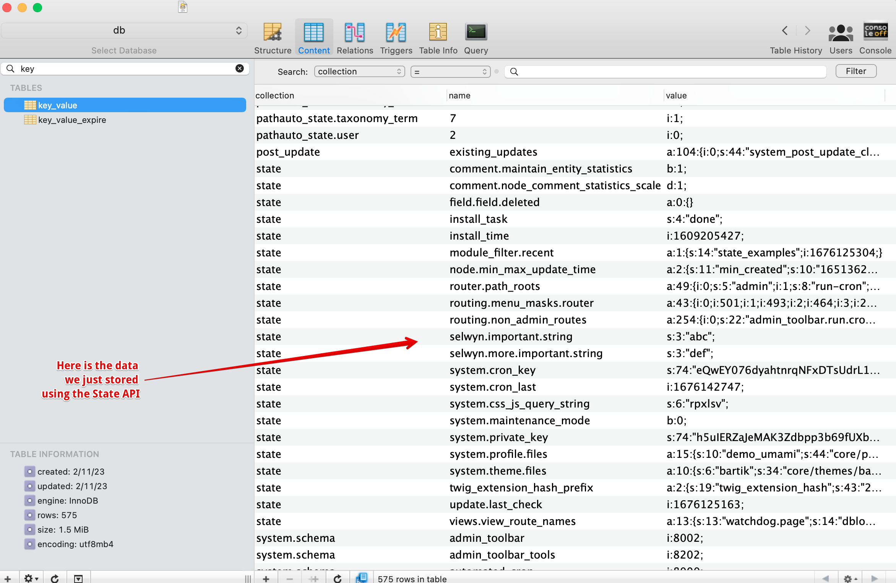

# State API, TempStore and UserData
{: .no_toc .fw-500 }

## Table of contents
{: .no_toc .text-delta }

- TOC
{:toc}


---

## Overview

The State API, TempStore API, and UserData are all storage mechanisms in Drupal. There is some overlap in their capabilities however they can be used for different purposes. Here is a brief explanation of each:

**State API:** This provides a global way to store key-value pairs of data that need to persist between page loads or can be shared across different parts of the website. It is used to persist data such as cron key, last cron run, system last check for updates, installation time and whether the system is in maintenance mode. It is like configuration data except it can\'t be exported (and imported) and stored in source code, thereby making it a little more secure. Typically, configuration settings are exportable values used in modules, features, or installation profiles e.g. front page path.

**UserData:** This allows you to store user-specific data (in key-value pairs) in a similar manner as the State API. Because the data is specific to each user, it is useful for custom user preferences or other user-specific information.

**TempStore:** This provides a way to store user-specific data (also key-value pairs) that may be needed for a short period of time but does not need to be permanently stored. For example, it can be used to store data that is being edited in a form, allowing users to continue working on the form even if they navigate away from the page before saving the changes. It is also ideal for storing data such as the contents of a shopping cart.  I've used tempstore to quickly access a list of nodes that need to be voted on by each voter.  This means they don't need to run a complex set of queries more than once.

{: .note }
Similarly to TempStore, you can also use the Drupal cache system to load complicated data really quickly.  I use this for storing arrays of nodes and data for a complicated voting application to improve scalability and performance.


## State API

The State API allows you to store small pieces of information specific to a site. This information is stored permanently in the database.

State API data is stored permanently in the key_value table. There is a `set()`, `get()` and `delete()` as well as `setMultiple()` and `getMultiple()` functions. The convention for the key name is to use periods(. or full-stops) to separate words. E.g. `my.state.data` or `emergency.header.message`. Underscores are also used e.g. `system.cron_key` or `system.cron_last`.

State settings are values which should usually not be exported to code, and only make sense in the context of one site. For example, cron key is a state setting whereas the front page path is a \"config\" variable.

To set a state value:

```php
\Drupal::state()->set('system.cron_key', md5("This is an example of a bad cron key")); 
```

In contrast, this is how you set a config value:

```php
\Drupal::configFactory()
  ->getEditable('system.site')
  ->set('page.front', 'node/1')
  ->save(); 
```

In Drupal 7, this was done using variable_set(). If you are upgrading from a Drupal 7 site, check out this article from March 2021 about upgrading to the Drupal 8 State system at <https://www.drupal.org/node/1787318>

Writing state data looks like this:

```php
\Drupal::state()->set('selwyn.important.string', 'abc');
\Drupal::state()->set('selwyn.more.important.string', 'def');
```
In the screenshot below, you can see where this is stored in the `key_value` table. Notice that the collection column is set to \"state\" indicating these are State API values.




### Using Drush to read the State API

You can use Drush to set, read or delete values in the State API: e.g. here we read the selwyn1 key value:

```bash
$ drush ev 'return \Drupal::state()->get("selwyn1");'
abc
```


### Example accessing State API

Here is code that shows examples of setting, getting and deleting state values:

```php
<?php

namespace Drupal\state_examples\Controller;

use Drupal\Core\Controller\ControllerBase;

/**
 * Returns responses for State API, TempStore and UserData Examples routes.
 */
class StateExamplesController extends ControllerBase {

  /**
   * Builds the response.
   */
  public function build1() {

    // Set single value.
    \Drupal::state()->set('selwyn1', 'abc');
    \Drupal::state()->set('selwyn2', 'def');
    $build['content'][] = [
      '#type' => 'item',
      '#markup' => $this->t('Retrieved State API data: selwyn1: %selwyn1 and selwyn2: %selwyn2 .', [
        '%selwyn1' => \Drupal::state()->get('selwyn1'),
        '%selwyn2' => \Drupal::state()->get('selwyn2'),
      ]),
    ];

    // Delete single value.
    \Drupal::state()->delete('selwyn1');
    \Drupal::state()->delete('selwyn2');
    $build['content'][] = [
      '#type' => 'item',
      '#markup' => $this->t('Deleted (single) State API data.'),
    ];

    // Set multiple values.
    \Drupal::state()->setMultiple(['selwyn1' => 'ghi', 'selwyn2' => 'jkl']);
    $build['content'][] = [
      '#type' => 'item',
      '#markup' => $this->t('Retrieved State API data: selwyn1: %selwyn1 and selwyn2: %selwyn2 .', [
        '%selwyn1' => \Drupal::state()->get('selwyn1'),
        '%selwyn2' => \Drupal::state()->get('selwyn2'),
      ]),
    ];

    \Drupal::state()->deleteMultiple(['selwyn1', 'selwyn2']);
    $build['content'][] = [
      '#type' => 'item',
      '#markup' => $this->t('Deleted (multiple) State API data.'),
    ];

    return $build;
  }

}
```


### Long strings broken into paragraphs

If you store long strings, you can explode them into arrays of
paragraphs for more control of their display.

```php
$str = 'Lorem ipsum dolor sit amet, consectetur adipiscing elit. Pellentesque porttitor urna consequat dolor convallis iaculis. Nullam blandit ipsum eget odio semper rhoncus. 
Aenean libero tortor, ullamcorper vitae porttitor sit amet, posuere a ante. Vestibulum ipsum tellus, porta eu ligula at, porttitor congue nunc. Suspendisse felis lacus, tristique vel aliquam eget, congue non mi.';

\Drupal::state()->set('selwyn.long.string', $str);

// Explode string into array of paragraphs. 
$test2 = explode( "\n", \Drupal::state()->get('selwyn.long.string'));
```


## UserData

UserData is stored permanently in the users_data table. This is
typically used for unstructured information pertaining to the user eg. user preferences, flags etc. I\'ve used it to keep track of a user\'s progress in a complicated web application.

Here is an example where a value of `COMPLETED` is stored, read back and then deleted for the key `program.123.vote.0.finalized`:

```php
public function build4() {

  /** @var \Drupal\user\UserDataInterface $userData */
  $userData = \Drupal::service('user.data');
  $user_id = 2;
  
  $userData->set('state_examples', $user_id, 'program.123.vote.0.finalized', 'COMPLETED');

  $build['content'][] = [
    '#type' => 'item',
    '#markup' => $this->t('Retrieved User Data API data: %value1.', [
      '%value1' => $userData->get('state_examples', $user_id, 'program.123.vote.0.finalized'),
    ]),
  ];

  $userData->delete('state_examples', $user_id, 'program.123.vote.0.finalized');

  return $build;
}
```

Here is the data stored in the `users_data` table. Notice that there is also some user data from the contact module as well as the data from the `state_examples` module that was created from the code above.


## TempStore

TempStore is used to keep temporary data across multiple requests. The data is intended to be non-cache data (i.e. not easily be rebuilt) and is stored in the `key_value_expire` table.

TempStore has two flavors, private and shared. The difference between them is that the private TempStore entries are connected to a specific user (via their user id) whereas shared TempStore entries can be shared between multiple users. Shared TempStore could for example be used to trigger a locking mechanism.

### PrivateTempStore

The Drupal *tempstore.private* service is used to allow temporary user data that is available from one web request to the next. It is intended to be used for non-cache data that cannot easily be rebuilt. This includes work-in-progress data that isn\'t ready to be saved permanently.

The temporary store is a key/value store and can therefore store
anything from a single Boolean value to a serialized object. (adapted from <https://www.hashbangcode.com/article/drupal-9-using-private-temporary-store-service>)

**Stores and retrieves temporary data for a given owner.**

A PrivateTempStore can be used to make temporary, non-cache data
available across requests. The data for the PrivateTempStore is stored in one key/value collection. PrivateTempStore data expires automatically after a given timeframe.

*By default, data is stored for one week (604800 seconds) before
expiring.*

The PrivateTempStore is different from a cache because the data in it is not yet saved permanently and so it cannot be rebuilt. Typically, the PrivateTempStore might be used to store work in progress that is later saved permanently elsewhere, e.g. autosave data, multistep forms, or in-progress changes to complex configuration that are not ready to be saved.

The PrivateTempStore differs from the SharedTempStore in that all keys are ensured to be unique for a particular user and users can never share data. If you want to be able to share data between users or use it for locking, use \\Drupal\\Core\\TempStore\\SharedTempStore.
(Adapted from
<https://api.drupal.org/api/drupal/core%21lib%21Drupal%21Core%21TempStore%21PrivateTempStore.php/class/PrivateTempStore/9.0.x>)

In this example, we can see writing, reading, and deleting a private TempStore value:

```php
  public function build5() {

    // Private TempStore example.

    // Get the private TempStore for the state_examples module.
    $tempstore = \Drupal::service('tempstore.private')->get('state_examples');
    $tempstore->set('selwyn.important.string', 'abcdef');

    $build['content'][] = [
      '#type' => 'item',
      '#markup' => $this->t('Retrieved Private TempStore API data: %value1.', [
        '%value1' => $tempstore->get('selwyn.important.string'),
      ]),
    ];

//    $tempstore->delete('selwyn.important.string');

    return $build;
  }
```

Drupal automatically inserts the user id (e.g. 1:) into the front of the name field so that the data is connected with that user. Notice in the database screenshot below that the name field (i.e.
1:selwyn.important.string) is preceded by 1: which makes it unique. Even though the code specified \"selwyn.important.string\" each user gets a unique copy. I was logged in as user 1 when I ran this program initially, and then I ran it again logged in as user 2.


In the next example we\'re storing an array with the key
\"selwyn.important.array\". The array is automatically serialized into the value field. Incidentally, you don\'t have to specify the type of content (i.e. array) as I have. Instead of using selwyn.important.array, you could use selwyn.important.banana or selwyn.important.kiwi (depending on your fruit preference).

```php
// Store an array.
$array = [
  'id' => '123',
  'name' => 'Dave',
];
$tempstore->set('selwyn.important.array', $array);
$array = $tempstore->get('selwyn.important.array');

$build['content'][] = [
  '#type' => 'item',
  '#markup' => $this->t('Retrieved Private TempStore API data: id = %value1, name= %value2.', [
    '%value1' => $array['id'],
    '%value2' => $array['name'],
  ]),
];

// Delete the data.
$tempstore->delete('selwyn.important.array');
```


This is a screenshot of the value for the array field above. Notice the id = 123 and name = Dave. There is no need to manipulate the data to get it stored away safely. Drupal will serialize it for you:


Also see this article showing how to save values from a form and then later retrieve and process them in a controller. Saving temporarily values of a form with Private Tempstore in Drupal 8 by Karim Boudjema Mar 2019 <http://karimboudjema.com/en/drupal/20190315/saving-temporary-values-form-private-tempstore-drupal-8>


### SharedTempStore

**Stores and retrieves temporary data for a given owner.**

A SharedTempStore can be used to make temporary, non-cache data
available across requests. The data for the SharedTempStore is stored in a key/value pair. SharedTempStore data expires automatically after a given timeframe.

*By default, data is stored for one week (604800 seconds) before
expiring.*

The SharedTempStore is different from a cache because the data in it is not yet saved permanently and so it cannot be rebuilt. Typically, the SharedTempStore might be used to store work in progress that is later saved permanently elsewhere, e.g. autosave data, multistep forms, or in-progress changes to complex configuration that are not ready to be saved.

Each SharedTempStore belongs to a particular owner (e.g. a user,
session, or process). Multiple owners may use the same key/value
collection, and the owner is stored along with the key/value pair in the value field.

Every key is unique within the collection, so the SharedTempStore can check whether a particular key is already set by a different owner. This is useful for informing one owner that the data is already in use by another; for example, to let one user know that another user is in the process of editing certain data, or even to restrict other users from editing it at the same time. It is the responsibility of the implementation to decide when and whether one owner can use or update another owner\'s data.

If you want to be able to ensure that the data belongs to the current user, use \\Drupal\\Core\\TempStore\\PrivateTempStore.
(Adapted from <https://api.drupal.org/api/drupal/core%21lib%21Drupal%21Core%21TempStore%21PrivateTempStore.php/class/PrivateTempStore/9.0.x>)

Here is example code showing writing, reading and deleting data from SharedTempStore:

```php
  public function build6() {

    // Shared TempStore example.

    // Get the shared TempStore for the state_examples module.
    /** @var \Drupal\Core\TempStore\SharedTempStoreFactory $factory */
    $factory = \Drupal::service('tempstore.shared');
    $tempstore = $factory->get('state_examples');

    // Store an array.
    $agent_array = [
      'id' => '007',
      'name' => 'James Bond',
    ];
    $tempstore->set('selwyn.important.agent', $agent_array);

    // Retrieve the data.
    $array = $tempstore->get('selwyn.important.agent');
    $build['content'][] = [
      '#type' => 'item',
      '#markup' => $this->t('Retrieved Private TempStore API data: id = %value1, name= %value2.', [
        '%value1' => $array['id'],
        '%value2' => $array['name'],
      ]),
    ];

    // Delete the data.
//    $tempstore->delete('selwyn.important.agent');

    return $build;
  }
```
And here is the data in the database:


And you can see the data owner in the screen shot below:


#### Injecting tempstore.shared

If you want to inject the service rather than use it statically, you have to inject `tempstore.shared`. e.g. In the `module.services.yml` file below, we inject 3 services, including the `tempstore.shared`.  Note that this is actually the `SharedTempStoreFactory` (and not the `SharedTempStore` class itself).  Remember to derive the "collection" as shown in the php snippet below:

```yml
services:
  tea_teks_srp.vote_processor:
    class: Drupal\tea_teks_srp\VotingProcessor
    arguments: ['@entity_type.manager', '@current_user', '@tempstore.shared']
```

```php
  /** @var \Drupal\Core\TempStore\SharedTempStore|null  */
  protected ?SharedTempStore $tempStore = NULL;

  public function __construct(EntityTypeManager $entityTypeManager, AccountInterface $account, SharedTempStoreFactory $sharedTempStoreFactory) {
    $this->entityTypeManager = $entityTypeManager;
    $this->account = $account;
    // Derive the collection.
    // Note. this will write into the key_value_expire table collection column: tempstore.shared.tea_teks_srp.   */
    $this->tempStore = $sharedTempStoreFactory->get('tea_teks_srp');
  }

  public function create(ContainerInterface $container) {
    return new static(
      $container->get('entity_type.manager'),
      $container->get('current_user'),
      $container->get('tempstore.shared')
    );
  }
```
Here is an example of actually writing and then reading the value from the shared tempstore.

```php
    $now = new DrupalDateTime('now');
    $votes[12345] = [
      'vote' => 'a',
      'reason' => '',
      'timestamp' => $now->format('Y-m-d H:i:s'),
      'serialized' => FALSE,
    ];
    // Write.
    $this->tempStore->set($this->tempstoreKey, $votes);
    // Read.
    $x = $this->tempStore->get($this->tempstoreKey);

```


In `core.services.yml`, you can see that `tempstore.shared` uses the `SharedTempStoreFactory` class:

```yml
  tempstore.shared:
    class: Drupal\Core\TempStore\SharedTempStoreFactory
    arguments: ['@keyvalue.expirable', '@lock', '@request_stack', '@current_user', '%tempstore.expire%']
    tags:
      - { name: backend_overridable }
```


## Reference

-   State API Overview updated September 2022
    <https://www.drupal.org/docs/8/api/state-api/overview>

-   If you are upgrading from a Drupal 7 site which uses variable_set, check out this article from March 2021 about upgrading to the Drupal 8 State system at <https://www.drupal.org/node/1787318>

-   Drupal API documentation for UserData <https://api.drupal.org/api/drupal/core%21modules%21user%21src%21UserData.php/class/UserData/8.2.x>

-   Drupal API documentation for UserData::get <https://api.drupal.org/api/drupal/core%21modules%21user%21src%21UserData.php/function/UserData%3A%3Aget/8.2.x>

-   Storing user data such as preferences in Drupal 8 using the UserData service by Daniel Sipos Mar 2017 <https://www.webomelette.com/storing-user-data-such-preferences-drupal-8-using-userdata-service>

-   Drupal Documentation on PrivateTempStore <https://api.drupal.org/api/drupal/core%21lib%21Drupal%21Core%21TempStore%21PrivateTempStore.php/class/PrivateTempStore/9.0.x>

-   Drupal 8: Tempstore (with code snippets) by Oleksii Raiu <https://alexrayu.com/snippets/drupal-8-tempstore>

-   Drupal 9: Using The Private Temporary Store Service by Phil Norton July 2022 <https://www.hashbangcode.com/article/drupal-9-using-private-temporary-store-service>

-   Saving temporarily values of a form with Private Tempstore in Drupal 8 by Karim Boudjema Mar 2019 <http://karimboudjema.com/en/drupal/20190315/saving-temporary-values-form-private-tempstore-drupal-8>

---

<script src="https://giscus.app/client.js"
        data-repo="selwynpolit/d9book"
        data-repo-id="MDEwOlJlcG9zaXRvcnkzMjUxNTQ1Nzg="
        data-category="Q&A"
        data-category-id="MDE4OkRpc2N1c3Npb25DYXRlZ29yeTMyMjY2NDE4"
        data-mapping="title"
        data-strict="0"
        data-reactions-enabled="1"
        data-emit-metadata="0"
        data-input-position="bottom"
        data-theme="preferred_color_scheme"
        data-lang="en"
        crossorigin="anonymous"
        async>
</script>
