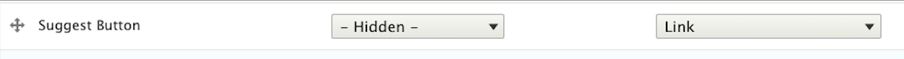

# TWIG

<h3 style="text-align: center;">
<a href="/d9book">home</a>
</h3>

- [TWIG](#twig)
  - [Overview](#overview)
    - [Theme System Overview](#theme-system-overview)
    - [Twig Templating Engine](#twig-templating-engine)
  - [Displaying Data](#displaying-data)
    - [Fields or Logic](#fields-or-logic)
    - [Which template, which variables?](#which-template-which-variables)
    - [Display fields or variables](#display-fields-or-variables)
    - [Node Title with and without a link](#node-title-with-and-without-a-link)
    - [Fields](#fields)
    - [Paragraph field](#paragraph-field)
    - [Loop thru paragraph reference fields](#loop-thru-paragraph-reference-fields)
    - [Body](#body)
    - [Multi-value fields](#multi-value-fields)
    - [Fields with HTML](#fields-with-html)
    - [The date/time a node is published, updated or created](#the-datetime-a-node-is-published-updated-or-created)
    - [Format a date field](#format-a-date-field)
    - [Smart date field formatting](#smart-date-field-formatting)
    - [Entity Reference field](#entity-reference-field)
    - [Entity reference destination content](#entity-reference-destination-content)
    - [Taxonomy term](#taxonomy-term)
    - [Render a block](#render-a-block)
    - [Render a list created in the template\_preprocess\_node()](#render-a-list-created-in-the-template_preprocess_node)
    - [Links](#links)
    - [Links to other pages on site](#links-to-other-pages-on-site)


<h3 style="text-align: center;">
<a href="/d9book">home</a>
</h3>

Drupal 10 uses **Twig 3**. Drupal 9 uses Twig 2. Drupal 8 used Twig 1.

## Overview

### Theme System Overview

Drupal\'s theme system allows a theme to have nearly complete control
over the appearance of the site, which includes both the markup and the
CSS used to style the markup. For this system to work, instead of
writing HTML markup directly, modules return \"render arrays\", which
are structured hierarchical arrays that include the data to be rendered
into HTML, and options that affect the markup. Render arrays are
ultimately rendered into HTML or other output formats by recursive calls
to [\\Drupal\\Core\\Render\\RendererInterface::render](https://api.drupal.org/api/drupal/core%21lib%21Drupal%21Core%21Render%21RendererInterface.php/function/RendererInterface%3A%3Arender/10)(),
traversing the depth of the render array hierarchy. At each level, the
theme system is invoked to do the actual rendering. See the
documentation
of [\\Drupal\\Core\\Render\\RendererInterface::render](https://api.drupal.org/api/drupal/core%21lib%21Drupal%21Core%21Render%21RendererInterface.php/function/RendererInterface%3A%3Arender/10)()
and the [Theme system and Render API
topic](https://api.drupal.org/api/drupal/core%21lib%21Drupal%21Core%21Render%21theme.api.php/group/theme_render/10) for
more information about render arrays and rendering.

### Twig Templating Engine

Drupal uses the templating engine Twig. Twig offers developers a fast,
secure, and flexible method for building templates for Drupal 8 sites.
Twig does not require front-end developers to know PHP to build and
manipulate Drupal themes.

For more on theming in Drupal
see <https://www.drupal.org/docs/theming-drupal> .

For further Twig documentation
see [https://twig.symfony.com/doc/2.x](https://twig.symfony.com/doc/2.x%20/)
and <https://twig.symfony.com/doc/3.x>

Note. Drupal 10 uses **Twig 3**, Drupal 9 uses Twig 2 and Drupal 8 used
Twig 1.

## Displaying Data

### Fields or Logic

Twig can do things that PHP can't such as whitespacing control, sandboxing, automatic HTML escaping, manual contextual output escaping, inclusion of custom functions and filters that only affect templates.

Double curly braces are used to output a variable. E.g.

```twig
{{ content.title }}
```

Brace and percent are used to put logic into Twig templates e.g. if, then, else or for loops. E.g.

```twig

  <h2>Price: {{ content.price }} </h2>

```

Use brace and pound symbol (hash) for comments e.g.

```twig
{# this section displays the voting details #}
```

Here are some of the Twig functions that you can use in twig templates: <https://www.drupal.org/docs/8/theming/twig/functions-in-twig-templates> There are lots of them e.g.


- `file_url($uri)`
- `link($text, $uri, $attributes)`
- `path($name, $parameters, $options)`
- `url($name, $parameters, $options)`

And even more Twig fun at <https://twig.symfony.com/doc/3.x/functions/index.html>


### Which template, which variables?

There is usually one `page.tpl.php` and *multiple* node templates. One node template per content type. Eg. `node-news-story.html.twig`, `node-event.html.twig`. There can also be field specific templates e.g. `web/themes/custom/txg/templates/field/field--field-3-column-links.html.twig`

In the `page.html.twig`, you can refer to variables as `page.content` or `node.label`

whereas node templates expect `content.field_image` or `node.field_myfield`

Note. If you don't see a field output for a node, try specifying the preface `node.` instead of `content.`.

Field specific template are usually very simple and refer to 
```twig
{{ items }}
```
 and 
 ```twig
 {{ item.content }} 
 ```

e.g. from txg/web/themes/contrib/zurb_foundation/templates/page.html.twig

```twig
<section>
  {{ page.content }}
</section>
```

And from `txg/web/themes/custom/txg/templates/content/page--node--event.html.twig` I accidentally started implementing this in the page template. See below
for the node template.

```twig
{{ drupal_field('field_image', 'node') }}

<h1>{{ node.label }}</h1>
<div>For: {{ node.field_for.0.value }}</div>
<div>DATE: {{ node.field_event_date.0.value|date('n/j/Y') }}</div>
<div>Time: {{ node.field_event_date.0.value|date('h:ia') }} - {{ node.field_event_date.0.end_value|date('h:ia') }}</div>

<div>
  Location:
    
    <a href="{{ node.field_event_location_link.0.url }}">{{ node.field_event_location.0.value }}</a>
    
    {{ node.field_event_location.0.value }}
    
</div>


  CTA:<div class="button"><a href="{{ node.field_event_cta_link.0.url }}">{{ node.field_event_cta_link.0.title }}</a></div>

```

Here is the same basic stuff (as above) but implemented in the node template at `txg/web/themes/custom/txg/templates/content/node--event.html.twig`:

>Note. That `node.label` becomes `label` and `node.field_for` becomes `content.field_for`.

```twig
<h1>{{ label }}</h1>
{{ content.field_image }}
<div>Node: {{ node.id }}</div>
<div>For: {{ content.field_for }}</div>
<div>DATE: {{ node.field_event_date.0.value|date('n/j/Y') }}</div>
<div>Time: {{ node.field_event_date.0.value|date('h:ia') }} - {{ node.field_event_date.0.end_value|date('h:ia') }}</div>
<div>
  Location:
  
    <a href="{{ node.field_event_location_link.0.url }}">{{ node.field_event_location.0.value }}</a>
  
    {{ node.field_event_location.0.value }}
  
</div>


  CTA:<div class="button"> <a href="{{ node.field_event_cta_link.0.url }}">{{ node.field_event_cta_link.0.title }}</a></div>

```

### Display fields or variables

Using `node.field_myfield` will bypass the rendering and display any markup in the field. Using `content.field_myfield` uses the rendering system and is the preferred way to display your content.

This will display all the content rendered

```twig
{{ content }}
```

### Node Title with and without a link

Render node title (or label) (with markup -- so it may include \<span\> tags)

```twig
{{ label }}
```

Render node label (without markup -- no html in this version)

```twig
{{ node.label }}
```

Render link to node

```twig
<a href="{{ url }}">{{ label }}</a>
```

// Or a little more complex..
```twig
<div class="title"><a href="{{ url }}">{{ label }}</a> | <span>{{ content.field_vendor_ref }}</span></div>
```

### Fields

There are many ways to limit things and only show some of the content. Mostly often you will need to show specific fields. Note. This will include rendered info such as labels etc.

```twig
{{ content.field_yomama }}
```

or

```twig
{{ content.field_ref_topic }}
```

Any field -- just jam `content.` in front of it

```twig
{{ content.field_intl_students_and_scholars }}
```

You can also grab node specific fields if `content.` type fields don't do the trick.

In a node template, you can display specific node fields by prefacing them with `node` e.g.:

```twig
{{ node.id }}
{{ node.label }}
{{ node.field_date.value }}
{{ node.field_date.end_value }}
```


### Paragraph field

These still work fine: `content.field_abc` or `node.field_ref_topic` but instead of `node`, you preface fields with `paragraph` like this:

```twig
termid0: {{ paragraph.field_ref_tax.0.target_id }}
termid1: {{ paragraph.field_ref_tax.1.target_id }}
```
and we get this result if we have selected two terms 13 and 16.

```
termid0: 13
termid1: 16
```

To dump a taxonomy reference field for debugging purposes use the code below. The pre tags format it a little nicer than if we don't have them.

```twig
<pre>
{{ dump(paragraph.field_ref_tax.value) }}
</pre>
```

### Loop thru paragraph reference fields

Here we go looping thru all the values in a multi-value reference field.

```twig

  <div>target_id: {{ tax.target_id }}</div>

```

It's the same as outputting these guys:

```twig
termid0: {{ paragraph.field_ref_tax.0.target_id }}
termid1: {{ paragraph.field_ref_tax.1.target_id }}
```
and to make this more useful, here we build a string of them to pass to a view.

From:
dirt/web/themes/custom/dirt_bootstrap/templates/paragraphs/paragraph\--news-preview.html.twig

```twig

{# Figure out parameters to pass to view for news items #}


  
  
    
  

params: {{ params }}

```

This will output something like: 5+6+19

### Body

```twig
{{ content.body }}
```
Or

```twig
{{ node.body.value }}
```


And for summary

```twig
{{ node.body.summary | raw }}
```
### Multi-value fields

Fields that you preface with `node.` can also handle an index (the 0 below) i.e. to indicate the first value in a multi-value field, 1 to indicate the second etc.

```twig
{{ node.field_iso_n3_country_code.0.value }}
```

### Fields with HTML

If a field has html that you want rendered, use the keyword raw. Be
aware this has security considerations which you can mitigate using
[striptags](https://twig.symfony.com/doc/3.x/filters/striptags.html)
filters:

```twig
<div>How to order: {{ how_to_order|raw }}</div>
```

And maybe you want to only allow \<b\> tags

```twig
{{ word|striptags('<b>')|raw }}
```

Or several tags. In this case \<b\>\<a\>\<pre\>


```twig
{{ word|striptags('<b>,<a>,<pre>')|raw }}
```

### The date/time a node is published, updated or created

Each of these calls return a datetime value in string form which can be
massaged by the twig date() function for formatting.

```twig
<pre>
Created:   {{ node.created.value }}
Created:   {{ node.createdtime }}
Created:   {{ node.created.value|date('Y-m-d') }}

Modified:  {{ node.changed.value }}
Modified:  {{ node.changedtime }}
Modified:  {{ node.changed.value|date('Y-m-d') }}

Published: {{ node.published_at.value }}
Published: {{ node.published_at.value|date('Y-m-d') }}
</pre>
```

Here is the output you might see. Note. The first published is apparently blank because I didn't use the drupal scheduling to publish the node (maybe?) and the second one seems to have defaulted to today's date.

```
Created: 1604034000
Created: 1604034000
Created: 2020-10-30
Modified: 1604528207
Modified: 1604528207
Modified: 2020-11-04
Published:
Published: 2020-11-20
```

Updated/changed

```twig

```

Created (same as authored on date on node edit form):

```twig
{{ node.createdtime }}
```

And pretty formatted like Sep 2, 2023

```twig
{{ node.createdtime\|date('M d, Y') }}
```

Also


```twig
<div class="date">Date posted: {{ node.getCreatedTime|date('m/d/Y') }}</div>
<div class="date">Date posted: {{ node.getChangedTime|date('m/d/Y') }}</div>
```

Node published date:

```twig
Date published: {{ _context.node.published_at.value }}
Date published: {{ node.published_at.value }}
```

### Format a date field

Use the field's format settings; include wrappers. This example includes wrappers.

```twig
{{ content.field_blog_date }}
```

The examples below do not include wrappers. 

Use the field's format settings. This will use the format defined in `Content type » Manage Displays »Your View Mode`.

```twig
{{ content.field_blog_date.0 }}
```

Using Twig date filter and a defined Drupal date format

```twig
{{ node.field_blog_date.value|date('U')|format_date('short_mdyyyy') }}
```

Use Twig date filter

```twig
{{ node.field_blog_date.value|date('n/j/Y') }}
```


### Smart date field formatting

When using the [smart date](https://www.drupal.org/project/smart_date) module, dates are stored as timestamps so you have to use the twig date function to format them. If you just put this in your template:

```twig
{{ content.field_when }}
```

The output will include whichever formatting you specify in Drupal. While I assume there is a way to pass a [smart date](https://www.drupal.org/project/smart_date) formatting string to twig, I haven\'t discovered it yet. Here are ways to format a [smart date](https://www.drupal.org/project/smart_date).

Specify the index (the 0 indicating the first value, or 1 for the second) e.g. node.field.0.value and pipe the twig [date](https://twig.symfony.com/doc/3.x/filters/date.html) function  for formatting:

Date as in July 18, 2023
```twig
{{ node.field_when.0.value|date('F j, Y') }}
```


End date
```twig
{{ node.field_when.0.end_value|date('F j, Y') }}
```


Timezone as in America/Chicago

```twig
{{ node.field_when.0.value|date('e') }}
```


Timezone as in CDT
```twig
{{ node.field_when.0.value|date('T') }}
```


Day of the week
```twig
{{ node.field_when.0.value|date('l') }} {# day of week #}
```


Hide the end date if it is the same as the start date

```twig


  <p class="date"> {{ start }}</p>

  <p class="date"> {{ end }}</p>

```

### Entity Reference field

If you have an entity reference field such as field_ref_topic (entity reference to topic content) you have to specify the target_id like this. If you have only 1 reference, use the .0, for the second one use .1 and so on.

```twig
{{ node.field_ref_topic.0.target_id }}
```

Note. This will show the node id of the entity reference field. See below to see the content that the entity reference field points to.

### Entity reference destination content

If you have an entity reference and you want to display the content from the node that is referenced i.e. if you have a contract with a reference to the vendor node and you want to display information from the vendor node on the contract you can dereference fields in the entity destination:

From `dirt/web/themes/custom/dirt_bootstrap/templates/content/node--contract--vendor-list.html.twig`: 

```twig
{{ node.field_sf_contract_ref.entity.field_contract_overview.value }}
```

Or

```twig
{{ content.field_sf_contract_ref.entity.field_contract_overview }}
```

The field in the contract node is called `field_sf_contract_ref`. The field in the referenced entity is called field_contract_overview. Notice how with the `node.` style, you must specify `.value` at the end.

Here is an example of a taxonomy term where the title of the term will be displayed.

```twig
<pre>
Dump category:
{{ dump(node.field_ref_tax.entity.label) }}
</pre>
```

### Taxonomy term

Here is an example of displaying a taxonomy term.

```twig
<pre>
Dump category:
{{ dump(node.field_ref_tax.entity.label) }}
</pre>
```

### Render a block

Example block (block---system-powered-by-block.html.twig -- from a custom theme)

```twig


<div{{ attributes.addClass(classes) }}>
  {{ title_prefix }}
  
    <h2{{ title_attributes }}>{{ label }}</h2>
  
  {{ title_suffix }}
  
    {{ content }}
  
  also powered by <a href="http://austinprogressivecalendar.com">Austin Progressive Calendar</a>
</div>

```

### Render a list created in the template_preprocess_node()

Here we create a list in the function:

```php
function burger_theme_preprocess_node(&$variables) {

  $burger_list = [
    ['name' => 'Cheesburger'],
    ['name' => 'Mushroomburger'],
    ['name' => 'Chickenburger'],
  ];
  $variables['burgers'] = $burger_list;
}
```

and render it in the `node--article--full.html.twig`

```twig

<ol>
  
  <li>{{ burger['name'] }}</li>
  
</ol>

```

### Links

There are a bajillion kertrillion or more ways to render a link

Link field (URL)

This is the simplest way. Just set the display mode to link




And output the link without a label.

```twig

{{ content.field_suggest_button }}

```


If you need a little more control you might use this version which allows classes etc. We are adding several classes onto the anchor to make it look like a button. In this case with an internal link, it shows up using the alias of the link i.e. it shows `/contracts` instead of `node/7` when you hover over the link.

```twig

<p><a class="btn secondary navy centered" href="{{ node.field_suggest_button.0.url }}">{{ node.field_suggest_button.0.title }}</a></p>

```
Using `.uri` causes the link (internal only. External links are fine) to show up as `node/7` when you hover over the link.

```twig

<p><a class="btn secondary navy centered" href="{{ node.field_suggest_button.uri }}">{{ node.field_suggest_button.0.title }}</a></p>

```

Don't try this as it won't work:

```twig

//bad
{{ node.field_suggest_button.url }}.
//bad

```
Want to use the text from a different field? No problem.

```twig

<div class="title"><a href="{{ node.field_link.uri }}">{{ node.field_contract_number.value }}</a></div>

```

### Links to other pages on site

Absolute link:

```twig

<a href="{{ url('entity.node.canonical', {node: 3223}) }}">Link to Weather Balloon node 3223 </a>

```

Relative link

See path vs url:

```twig

<a href="{{ path('entity.node.canonical', {node: 3223}) }}">Link to Weather Balloon node 3223 </a>

```