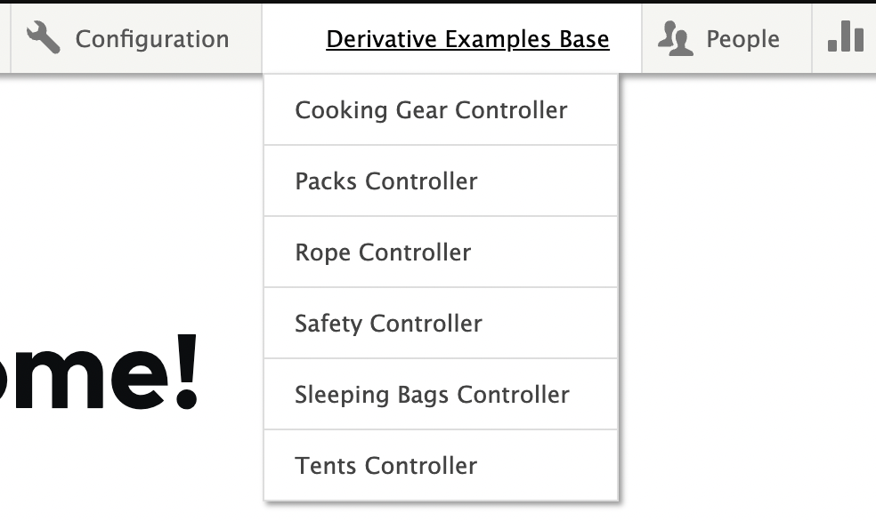
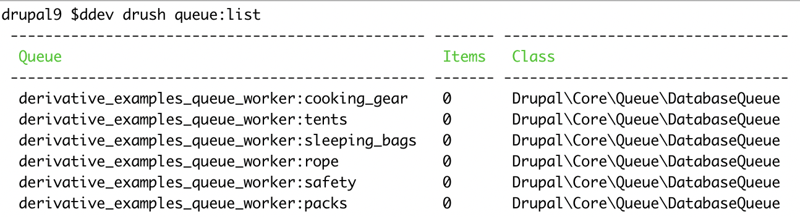
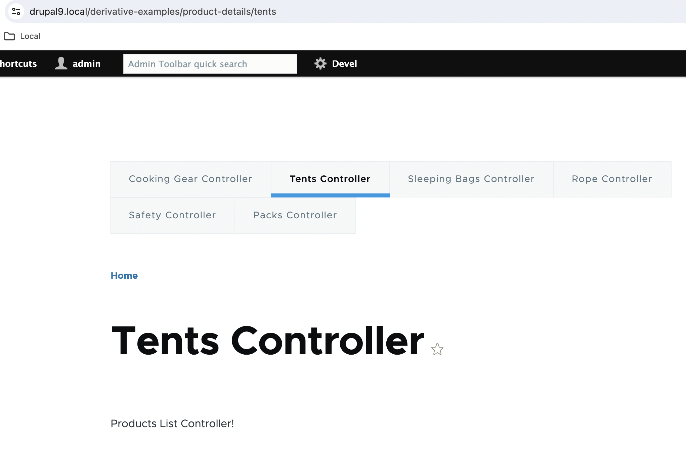

## INTRODUCTION

The Derivative Examples module is a module which provides Examples for Derivatives.

In Drupal, derivatives usually refer to derivative plugins or derivative entities, which are used to dynamically generate variations of existing content or functionality based on certain parameters or conditions.

One common use case for derivatives in Drupal is with the Drupal Plugin API, which allows developers to define derivative plugins. These plugins can be dynamically generated based on contextual information, such as the current URL, user role, or other criteria.

In this example, `DerivativeExamplesBlockDerivative` is a custom derivative class responsible for managing block derivatives. `DerivativeExamplesMenuDerivative` is a custom derivative class responsible for managing menu derivatives

These derivatives could be variations of a plugin based on certain conditions.

Common Plugin Derivatives :

1. Block Derivatives
2. Local Task Derivatives
3. Queue Derivatives
4. Menu Derivatives

## Block Derivates

Navigate to https://drupal10.local/admin/structure/block and you will observe the below blocks listed.

## Menu Derivatives

Here we create different menu items with derivatives.

## Queue Derivatives

Here we create different Queue items with derivatives.

## Local Task Derivatives

Here we create different menu local task with derivatives.

